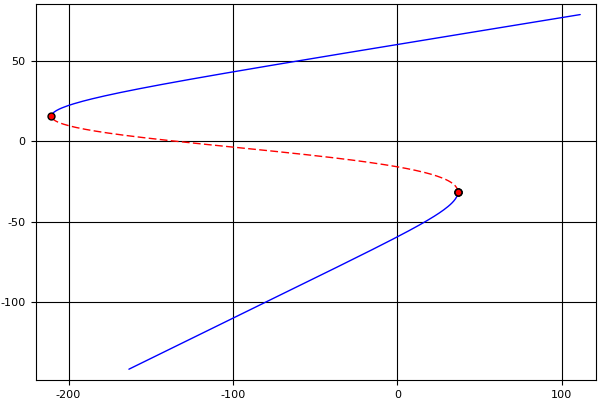

# Bifurcation Analysis

Bifurcation analysis is provided by the wrapper package PyDSTool.jl, which
wraps the functionality of PyDSTool. The the package has an interface for
directly using PyDSTool itself, included is a higher level interface that
makes these tools compatible with more standard JuliaDiffEq types.

This functionality does not come standard with DifferentialEquations.jl.
To use this functionality, you must install PyDSTool.jl:

```julia
Pkg.add("PyDSTool")
using PyDSTool
```

## Calcium Bifurcation Tutorial

In this tutorial we will show how to do some simple bifurcation plots. We will
follow the PyDSTool tutorial [for the calcium channel model](http://www.ni.gsu.edu/~rclewley/PyDSTool/Tutorial/Tutorial_Calcium.html)
and re-create the results using the wrapped functionality.

### Specification of a Model

We will specify the model using a ParameterizedFunction:

```julia
f = @ode_def Calcium begin
  dv = ( i + gl * (vl - v) - gca * 0.5 * (1 + tanh( (v-v1)/v2 )) * (v-vca) )/c
  dw = v-w
end vl vca i gl gca c v1 v2
```

(Note that using PyDSTool requires use of the `@ode_def` macro). Next to build the ODE we need an initial condition and a starting timepoint.

```julia
u0 = [0;0]
tspan = [0;30]
p = [-60,120,0.0,2,4,20,-1.2,18]
```

Then we use the following command to build the PyDSTool ODE:

```julia
dsargs = build_ode(f,u0,tspan,p)
```

Now we need to build the continuation type. Following the setup of PyDSTool's
tutorial, we need to start near the steady state. The commands translate as:

```julia
ode = ds[:Generator][:Vode_ODEsystem](dsargs)
ode[:set](pars = Dict("i"=>-220))
ode[:set](ics  = Dict("v"=>-170))
PC = ds[:ContClass](ode)
```

Once we have the continuation type, we can call the `bifurcation_curve` function.
Instead of building the args into some object one-by-one, we simply make a
function call with keyword arguments. Using the same arguments as the PyDSTool
tutorial:

```julia
bif = bifurcation_curve(PC,"EP-C",["i"],
                        max_num_points=450,
                        max_stepsize=2,min_stepsize=1e-5,
                        stepsize=2e-2,loc_bif_points="all",
                        save_eigen=true,name="EQ1",
                        print_info=true,calc_stab=true)
```

This returns a `BifurcationCurve` type. Important fields of this type are:

- `d`: the values along the curve
- `special_points`: the values for the bifurcation points
- `stab`: an array which gives the stability of each point along the curve.
  `"S"` is for stable, `N` is for neutral, and `U` is for unstable.

Instead of using the fields directly, we will use the plot recipe. The plot
recipe requires you give the `x,y` coordinates to plot. Here we will plot
it in the `(i,v)` plane:

```julia
using Plots
plot(bif,(:i,:v))
```


