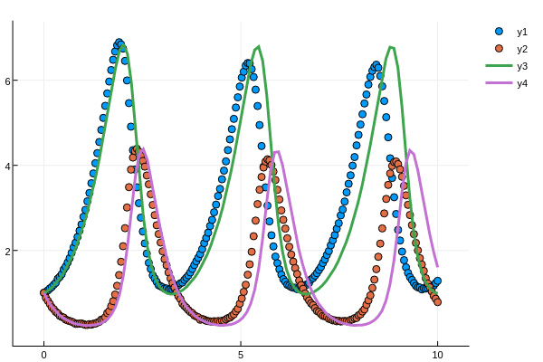
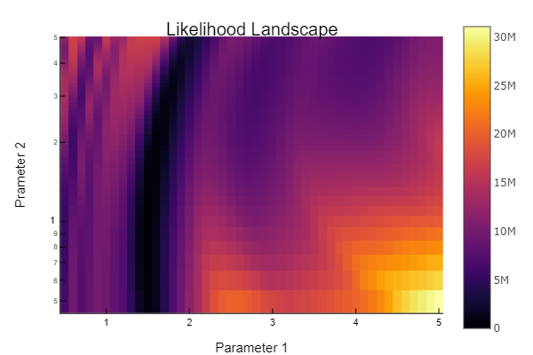
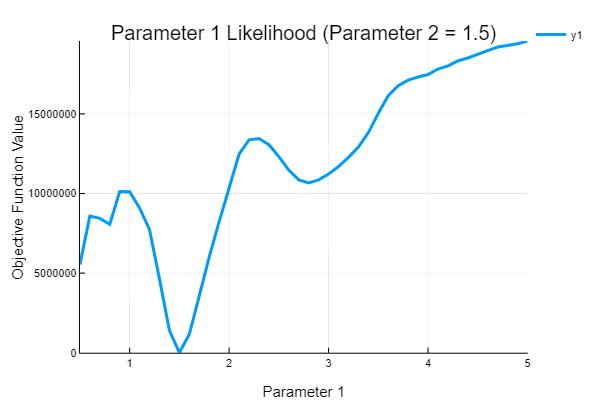

# Parameter Estimation

Parameter estimation for ODE models, also known as dynamic data analysis,
is provided by the DiffEq suite. Note these require that the problem is
defined using a
[ParameterizedFunction](https://github.com/JuliaDiffEq/ParameterizedFunctions.jl).

## Recommended Methods

The recommended method is to use `build_loss_objective` with the optimizer
of your choice. This method can thus be paired with global optimizers
from packages like BlackBoxOptim.jl or NLopt.jl which can be much less prone to
finding local minima than local optimization methods. Also, it allows the user
to define the cost function in the way they choose as a function
`loss(sol)`, and thus can fit using any cost function on the solution,
making it applicable to fitting non-temporal data and other types of
problems. Also, `build_loss_objective` works for all of the `DEProblem`
types, allowing it to optimize parameters on ODEs, SDEs, DDEs, DAEs,
etc.

However, this method requires repeated solution of the differential equation.
If the data is temporal data, the most efficient method is the
`two_stage_method` which does not require repeated solutions but is not as
accurate. Usage of the `two_stage_method` should have a post-processing step
which refines using a method like `build_loss_objective`.

### two_stage_method

The two-stage method is a collocation method for estimating parameters without
requiring repeated solving of the differential equation. It does so by
determining a smoothed estimated trajectory of the data and optimizing
the derivative function and the data's timepoints to match the derivatives
of the smoothed trajectory. This method has less accuracy than other methods
but is much faster, and is a good method to try first to get in the general
"good parameter" region, to then finish using one of the other methods.

```julia
function two_stage_method(prob::DEProblem,tpoints,data;kernel= :Epanechnikov,
                          loss_func = L2DistLoss,mpg_autodiff = false,
                          verbose = false,verbose_steps = 100)
```

### build_loss_objective

`build_loss_objective` builds an objective function to be used with Optim.jl and MathProgBase-associated solvers like NLopt.

```julia
function build_loss_objective(prob::DEProblem,alg,loss_func
                              regularization=nothing;
                              mpg_autodiff = false,
                              verbose_opt = false,
                              verbose_steps = 100,
                              prob_generator = problem_new_parameters,
                              kwargs...)
```

The first argument is the `DEProblem` to solve, and next is the `alg` to use.
The `alg` must match the problem type, which can be any `DEProblem`
(ODEs, SDEs, DAEs, DDEs, etc.). `regularization` defaults to nothing
which has no regulariztion function. One can also choose `verbose_opt` and
`verbose_steps`, which, in the optimization routines, will print the steps
and the values at the steps every `verbose_steps` steps. `mpg_autodiff` uses
autodifferentiation to define the derivative for the MathProgBase solver.
The extra keyword arguments are passed to the differential equation solver.

#### The Loss Function

```julia
loss_func(sol)
```

is a function which reduces the problem's solution to a scalar which the
optimizer will try to minimize. While this is very
flexible, two convenience routines are included for fitting to data with standard
cost functions:

```julia
L2Loss(t,data;weight=nothing)
CostVData(t,data;loss_func = L2Loss,weight=nothing)

```

where `t` is the set of timepoints which the data is found at, and
`data` are the values that are known. `L2Loss` is an optimized version
of the L2-distance. In `CostVData`, one can choose any loss function from
LossFunctions.jl or use the default of an L2 loss. The `weight` is a vector
of weights for the loss function which must match the size of the data.
Note that minimization of a weighted `L2Loss` is equivalent to maximum
likelihood estimation of a heteroskedastic Normally distributed likelihood.

Additionally, we include a more flexible log-likelihood approach:

```julia
LogLikeLoss(t,distributions;loss_func = L2Loss,weight=nothing)
```

In this case, there are two forms. The simple case is where `distributions[i,j]`
is the likelihood distributions from a `UnivariateDistribution` from
[Distributions.jl](https://juliastats.github.io/Distributions.jl/latest/), where it
corresponds to the likelihood at `t[i]` for component `j`. The second case is
where `distributions[i]` is a `MultivariateDistribution` which corresponds to
the likelihood at `t[i]` over the vector of components. This likelihood function
then calculates the negative of the total loglikelihood over time as its objective
value (negative since optimizers generally find minimimums, and thus this corresponds
to maximum likelihood estimation).

Note that these distributions can be generated via `fit_mle` on some dataset
against some chosen distribution type.

#### Note About Loss Functions

For parameter estimation problems, it's not uncommon for the optimizers to hit
unstable regions of parameter space. This causes warnings that the solver exited
early, and the built-in loss functions like `L2Loss` and `CostVData`
automatically handle this. However, if using a user-supplied loss function,
you should make sure it's robust to these issues. One common pattern is to
apply infinite loss when the integration is not successful. Using the retcodes,
this can be done via:

```julia
function my_loss_function(sol)
   tot_loss = 0.0
   if any((s.retcode != :Success for s in sol))
     tot_loss = Inf
   else
     # calculation for the loss here
   end
   tot_loss
end
```

#### The Regularization Function

The regularization can be any function of `p`, the parameter vector:

```julia
regularization(p)
```

The `Regularization` helper function builds a regularization using a
penalty function `penalty` from
[PenaltyFunctions.jl](https://github.com/JuliaML/PenaltyFunctions.jl):

```julia
Regularization(λ,penalty=L2Penalty())
```

The regularization defaults to L2 if no penalty function is specified.
`λ` is the weight parameter for the addition of the regularization term.

#### The Problem Generator Function

The argument `prob_generator` allows one to specify a function for generating
new problems from a given parameter set. By default, this just builds a new
version of `f` that inserts all of the parameters. For example, for ODEs this
is given by the dispatch on `DiffEqBase.problem_new_parameters` which does the
following:

```julia
function problem_new_parameters(prob::ODEProblem,p)
  f = (t,u,du) -> prob.f(t,u,p,du)
  uEltype = eltype(p)
  u0 = [uEltype(prob.u0[i]) for i in 1:length(prob.u0)]
  tspan = (uEltype(prob.tspan[1]),uEltype(prob.tspan[2]))
  ODEProblem(f,u0,tspan)
end
```

`f = (t,u,du) -> prob.f(t,u,p,du)` creates a new version of `f` that encloses
the new parameters. The element types for `u0` and `tspan` are set to match the
parameters. This is required to make autodifferentiation work. Then the new
problem with these new values is returned.

One can use this to change the meaning of the parameters using this function. For
example, if one instead wanted to optimize the initial conditions for a function
without parameters, you could change this to:

```julia
function my_problem_new_parameters(prob::ODEProblem,p)
  uEltype = eltype(p)
  tspan = (uEltype(prob.tspan[1]),uEltype(prob.tspan[2]))
  ODEProblem(prob.f,p,tspan)
end
```

which simply matches the type for time to `p` (once again, for autodifferentiation)
and uses `p` as the initial condition in the initial value problem.

### build_lsoptim_objective

`build_lsoptim_objective` builds an objective function to be used with LeastSquaresOptim.jl.

```julia
build_lsoptim_objective(prob,tspan,t,data;prob_generator = problem_new_parameters,kwargs...)
```

The arguments are the same as `build_loss_objective`.

### lm_fit

`lm_fit` is a function for fitting the parameters of an ODE using the Levenberg-Marquardt
algorithm. This algorithm is really bad and thus not recommended since, for example,
the Optim.jl algorithms on an L2 loss are more performant and robust. However,
this is provided for completeness as most other differential equation libraries
use an LM-based algorithm, so this allows one to test the increased effectiveness
of not using LM.

```julia
lm_fit(prob::DEProblem,tspan,t,data,p0;prob_generator = problem_new_parameters,kwargs...)
```

The arguments are similar to before, but with `p0` being the initial conditions
for the parameters and the `kwargs` as the args passed to the LsqFit `curve_fit`
function (which is used for the LM solver). This returns the fitted parameters.

## Local Optimization Examples

We choose to optimize the parameters on the Lotka-Volterra equation. We do so
by defining the function as a [ParameterizedFunction](https://github.com/JuliaDiffEq/ParameterizedFunctions.jl):

```julia
f = @ode_def LotkaVolterraTest begin
  dx = a*x - b*x*y
  dy = -c*y + d*x*y
end a=>1.5 b=1.0 c=3.0 d=1.0

u0 = [1.0;1.0]
tspan = (0.0,10.0)
prob = ODEProblem(f,u0,tspan)
```

Notice that since we only used `=>` for `a`, it's the only free parameter.
We create data using the numerical result with `a=1.5`:

```julia
sol = solve(prob,Tsit5())
t = collect(linspace(0,10,200))
using RecursiveArrayTools # for VectorOfArray
randomized = VectorOfArray([(sol(t[i]) + .01randn(2)) for i in 1:length(t)])
data = convert(Array,randomized)
```

Here we used `VectorOfArray` from [RecursiveArrayTools.jl](https://github.com/ChrisRackauckas/RecursiveArrayTools.jl)
to turn the result of an ODE into a matrix.

If we plot the solution with the parameter at `a=1.42`, we get the following:



Notice that after one period this solution begins to drift very far off: this
problem is sensitive to the choice of `a`.

To build the objective function for Optim.jl, we simply call the `build_loss_objective`
function:

```julia
cost_function = build_loss_objective(prob,Tsit5(),L2Loss(t,data),
                                     maxiters=10000,verbose=false)
```

This objective function internally is calling the ODE solver to get solutions
to test against the data. The keyword arguments are passed directly to the solver.
Note that we set `maxiters` in a way that causes the differential equation solvers to
error more quickly when in bad regions of the parameter space, speeding up the
process. If the integrator stops early (due to divergence), then those parameters
are given an infinite loss, and thus this is a quick way to avoid bad parameters.
We set `verbose=false` because this divergence can get noisy.

Before optimizing, let's visualize our cost function by plotting it for a range
of parameter values:

```julia
range = 0.0:0.1:10.0
using Plots; plotly()
plot(range,[cost_function(i) for i in range],yscale=:log10,
     xaxis = "Parameter", yaxis = "Cost", title = "1-Parameter Cost Function",
     lw = 3)
```


Here we see that there is a very well-defined minimum in our cost function at
the real parameter (because this is where the solution almost exactly fits the
dataset).

Now this cost function can be used with Optim.jl in order to get the parameters.
For example, we can use Brent's algorithm to search for the best solution on
the interval `[0,10]` by:

```julia
using Optim
result = optimize(cost_function, 0.0, 10.0)
```

This returns `result.minimizer[1]==1.5` as the best parameter to match the data.
When we plot the fitted equation on the data, we receive the following:


Thus we see that after fitting, the lines match up with the generated data and
receive the right parameter value.

We can also use the multivariate optimization functions. For example, we can use
the `BFGS` algorithm to optimize the parameter starting at `a=1.42` using:

```julia
result = optimize(cost_function, [1.42], BFGS())
```

Note that some of the algorithms may be sensitive to the initial condition. For more
details on using Optim.jl, see the [documentation for Optim.jl](http://julianlsolvers.github.io/Optim.jl/latest/).
We can improve our solution by noting that the Lotka-Volterra equation requires that
the parameters are positive. Thus [following the Optim.jl documentation](http://julianlsolvers.github.io/Optim.jl/latest/user/minimization/#box-minimization)
we can add box constraints to ensure the optimizer only checks between 0.0 and 3.0
which improves the efficiency of our algorithm:

```julia
lower = [0.0]
upper = [3.0]
result = optimize(obj, [1.42], lower, upper, Fminbox{BFGS}())
```

Lastly, we can use the same tools to estimate multiple parameters simultaneously.
Let's use the Lotka-Volterra equation with all parameters free:

```julia
f2 = @ode_def_nohes LotkaVolterraAll begin
  dx = a*x - b*x*y
  dy = -c*y + d*x*y
end a=>1.5 b=>1.0 c=>3.0 d=>1.0

u0 = [1.0;1.0]
tspan = (0.0,10.0)
prob = ODEProblem(f2,u0,tspan)
```

To solve it using LeastSquaresOptim.jl, we use the `build_lsoptim_objective` function:

```julia
cost_function = build_lsoptim_objective(prob,Tsit5(),L2Loss(t,data))
```

The result is a cost function which can be used with LeastSquaresOptim. For more
details, consult the [documentation for LeastSquaresOptim.jl](https://github.com/matthieugomez/LeastSquaresOptim.jl):

```julia
x = [1.3,0.8,2.8,1.2]
res = optimize!(LeastSquaresProblem(x = x, f! = cost_function,
                output_length = length(t)*length(prob.u0)),
                LeastSquaresOptim.Dogleg(),LeastSquaresOptim.LSMR(),
                ftol=1e-14,xtol=1e-15,iterations=100,grtol=1e-14)
```

We can see the results are:

```julia
println(res.minimizer)

Results of Optimization Algorithm
 * Algorithm: Dogleg
 * Minimizer: [1.4995074428834114,0.9996531871795851,3.001556360700904,1.0006272074128821]
 * Sum of squares at Minimum: 0.035730
 * Iterations: 63
 * Convergence: true
 * |x - x'| < 1.0e-15: true
 * |f(x) - f(x')| / |f(x)| < 1.0e-14: false
 * |g(x)| < 1.0e-14: false
 * Function Calls: 64
 * Gradient Calls: 9
 * Multiplication Calls: 135
```

and thus this algorithm was able to correctly identify all four parameters.

## More Algorithms (Global Optimization) via MathProgBase Solvers

The `build_loss_objective` function builds an objective function which is able
to be used with MathProgBase-associated solvers. This includes packages like
IPOPT, NLopt, MOSEK, etc. Building off of the previous example, we can build a
cost function for the single parameter optimization problem like:

```julia
f = @ode_def_nohes LotkaVolterraTest begin
  dx = a*x - b*x*y
  dy = -c*y + d*x*y
end a=>1.5 b=1.0 c=3.0 d=1.0

u0 = [1.0;1.0]
tspan = (0.0,10.0)
prob = ODEProblem(f,u0,tspan)
sol = solve(prob,Tsit5())

t = collect(linspace(0,10,200))
randomized = VectorOfArray([(sol(t[i]) + .01randn(2)) for i in 1:length(t)])
data = convert(Array,randomized)

obj = build_loss_objective(prob,Tsit5(),L2Loss(t,data),maxiters=10000)
```

We can now use this `obj` as the objective function with MathProgBase solvers.
For our example, we will use NLopt. To use the local derivative-free
Constrained Optimization BY Linear Approximations algorithm, we can simply do:

```julia
using NLopt
opt = Opt(:LN_COBYLA, 1)
min_objective!(opt, obj)
(minf,minx,ret) = NLopt.optimize(opt,[1.3])
```

This finds a minimum at `[1.49997]`. For a modified evolutionary algorithm, we
can use:

```julia
opt = Opt(:GN_ESCH, 1)
min_objective!(opt, obj)
lower_bounds!(opt,[0.0])
upper_bounds!(opt,[5.0])
xtol_rel!(opt,1e-3)
maxeval!(opt, 100000)
(minf,minx,ret) = NLopt.optimize(opt,[1.3])
```

We can even use things like the Improved Stochastic Ranking Evolution Strategy
(and add constraints if needed). This is done via:

```julia
opt = Opt(:GN_ISRES, 1)
min_objective!(opt, obj.cost_function2)
lower_bounds!(opt,[-1.0])
upper_bounds!(opt,[5.0])
xtol_rel!(opt,1e-3)
maxeval!(opt, 100000)
(minf,minx,ret) = NLopt.optimize(opt,[0.2])
```

which is very robust to the initial condition. The fastest result comes from the
following:

```julia
using NLopt
opt = Opt(:LN_BOBYQA, 1)
min_objective!(opt, obj)
(minf,minx,ret) = NLopt.optimize(opt,[1.3])
```

For more information, see the NLopt documentation for more details. And give IPOPT
or MOSEK a try!

## Generalized Likelihood Example

In this example we will demo the likelihood-based approach to parameter fitting.
First let's generate a dataset to fit. We will re-use the Lotka-Volterra equation
but in this case fit just two parameters. Note that the parameter estimation
tools do not require the use of the `@ode_def` macro, so let's demonstrate
what the macro-less version looks like:

```julia
pf_func = function (t,u,p,du)
  du[1] = p[1] * u[1] - p[2] * u[1]*u[2]
  du[2] = -3.0 * u[2] + u[1]*u[2]
end
f1 = ParameterizedFunction(pf_func,[1.5,1.0])
u0 = [1.0;1.0]
tspan = (0.0,10.0)
prob1 = ODEProblem(f1,u0,tspan)
sol = solve(prob1,Tsit5())
```

This is a function with two parameters, `[1.5,1.0]` which generates the same
ODE solution as before. This time, let's generate 100 datasets where at each point
adds a little bit of randomness:

```julia
using RecursiveArrayTools # for VectorOfArray
t = collect(linspace(0,10,200))
function generate_data(sol,t)
  randomized = VectorOfArray([(sol(t[i]) + .01randn(2)) for i in 1:length(t)])
  data = convert(Array,randomized)
end
aggregate_data = convert(Array,VectorOfArray([generate_data(sol,t) for i in 1:100]))
```

here with `t` we measure the solution at 200 evenly spaced points. Thus `aggregate_data`
is a 2x200x100 matrix where `aggregate_data[i,j,k]` is the `i`th component at time
`j` of the `k`th dataset. What we first want to do is get a matrix of distributions
where `distributions[i,j]` is the likelihood of component `i` at take `j`. We
can do this via `fit_mle` on a chosen distributional form. For simplicity we
choose the `Normal` distribution. `aggregate_data[i,j,:]` is the array of points
at the given component and time, and thus we find the distribution parameters
which fits best at each time point via:

```julia
distributions = [fit_mle(Normal,aggregate_data[i,j,:]) for i in 1:2, j in 1:200]
```

Notice for example that we have:

```julia
julia> distributions[1,1]
Distributions.Normal{Float64}(μ=1.0022440583676806, σ=0.009851964521952437)
```

that is, it fit the distribution to have its mean just about where our original
solution was and the variance is about how much noise we added to the dataset.
This this is a good check to see that the distributions we are trying to fit
our parameters to makes sense.

Note that in this case the `Normal` distribution was a good choice, and in many
cases it's a nice go-to choice, but one should experiment with other choices
of distributions as well. For example, a `TDist` can be an interesting way to
incorporate robustness to outliers since low degrees of free T-distributions
act like Normal distributions but with longer tails (though `fit_mle` does not
work with a T-distribution, you can get the means/variances and build appropriate
distribution objects yourself).

Once we have the matrix of distributions, we can build the objective function
corresponding to that distribution fit:

```julia
using DiffEqParamEstim
obj = build_loss_objective(prob1,Tsit5(),LogLikeLoss(t,distributions),
                                     maxiters=10000,verbose=false)
```

First let's use the objective function to plot the likelihood landscape:

```julia
using Plots; plotly()
range = 0.5:0.1:5.0
heatmap(range,range,[obj([j,i]) for i in range, j in range],
        yscale=:log10,xlabel="Parameter 1",ylabel="Prameter 2",
        title="Likelihood Landscape")
```



Recall that this is the negative loglikelihood and thus the minimum is the
maximum of the likelihood. There is a clear valley where the second parameter
is 1.5, while the first parameter's likelihood is more muddled. By taking a
one-dimensional slice:

```julia
plot(range,[obj([i,1.0]) for i in range],lw=3,
     title="Parameter 1 Likelihood (Parameter 2 = 1.5)",
     xlabel = "Parameter 1", ylabel = "Objective Function Value")
```



we can see that there's still a clear minimum at the true value. Thus we will
use the global optimizers from BlackBoxOptim.jl to find the values. We set our
search range to be from `0.5` to `5.0` for both of the parameters and let it
optimize:

```julia
using BlackBoxOptim
bound1 = Tuple{Float64, Float64}[(0.5, 5),(0.5, 5)]
result = bboptimize(obj;SearchRange = bound1, MaxSteps = 11e3)

Starting optimization with optimizer BlackBoxOptim.DiffEvoOpt{BlackBoxOptim.FitPopulation{Float64},B
lackBoxOptim.RadiusLimitedSelector,BlackBoxOptim.AdaptiveDiffEvoRandBin{3},BlackBoxOptim.RandomBound
{BlackBoxOptim.RangePerDimSearchSpace}}
0.00 secs, 0 evals, 0 steps
0.50 secs, 1972 evals, 1865 steps, improv/step: 0.266 (last = 0.2665), fitness=-737.311433781
1.00 secs, 3859 evals, 3753 steps, improv/step: 0.279 (last = 0.2913), fitness=-739.658421879
1.50 secs, 5904 evals, 5799 steps, improv/step: 0.280 (last = 0.2830), fitness=-739.658433715
2.00 secs, 7916 evals, 7811 steps, improv/step: 0.225 (last = 0.0646), fitness=-739.658433715
2.50 secs, 9966 evals, 9861 steps, improv/step: 0.183 (last = 0.0220), fitness=-739.658433715

Optimization stopped after 11001 steps and 2.7839999198913574 seconds
Termination reason: Max number of steps (11000) reached
Steps per second = 3951.50873439296
Function evals per second = 3989.2242527195904
Improvements/step = 0.165
Total function evaluations = 11106


Best candidate found: [1.50001, 1.00001]

Fitness: -739.658433715
```

This shows that it found the true parameters as the best fit to the likelihood.
