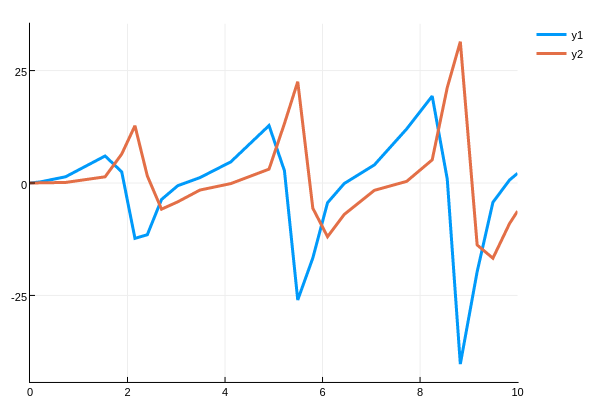

# Sensitivity Analysis

Sensitivity analysis for ODE models is provided by the DiffEq suite.

## Local Sensitivity Analysis

The local sensitivity of the solution to a parameter is defined by how much the
solution would change by changes in the parameter, i.e. the sensitivity of the
ith independent variable to the jth parameter is `` \frac{\partial y}{\partial p_{j}}``.

The local sensitivity is computed using the sensitivity ODE:

```math
\frac{d}{dt}\frac{\partial u}{\partial p_{j}}=\frac{\partial f}{\partial y}\frac{\partial y}{\partial p_{j}}+\frac{\partial f}{\partial p_{j}}=J\cdot S_{j}+F_{j}
```

where

```math
J=\left(\begin{array}{cccc}
\frac{\partial f_{1}}{\partial y_{1}} & \frac{\partial f_{1}}{\partial y_{2}} & \cdots & \frac{\partial f_{1}}{\partial y_{k}}\\
\frac{\partial f_{2}}{\partial y_{1}} & \frac{\partial f_{2}}{\partial y_{2}} & \cdots & \frac{\partial f_{2}}{\partial y_{k}}\\
\cdots & \cdots & \cdots & \cdots\\
\frac{\partial f_{k}}{\partial y_{1}} & \frac{\partial f_{k}}{\partial y_{2}} & \cdots & \frac{\partial f_{k}}{\partial y_{k}}
\end{array}\right)
```

is the Jacobian of the system,

```math
F_{j}=\left(\begin{array}{c}
\frac{\partial f_{1}}{\partial p_{j}}\\
\frac{\partial f_{2}}{\partial p_{j}}\\
\vdots\\
\frac{\partial f_{k}}{\partial p_{j}}
\end{array}\right)
```

are the parameter derivatives, and

```math
S_{j}=\left(\begin{array}{c}
\frac{\partial y_{1}}{\partial p_{j}}\\
\frac{\partial y_{2}}{\partial p_{j}}\\
\vdots\\
\frac{\partial y_{k}}{\partial p_{j}}
\end{array}\right)
```

is the vector of sensitivities. Since this ODE is dependent on the values of the
independent variables themselves, this ODE is computed simultaneously with the
actual ODE system.

### Defining a Sensitivity Problem

To define a sensitivity problem, simply use the `ODELocalSensitivityProblem` type
instead of an ODE type. Note that this requires a [ParameterizedFunction](https://github.com/JuliaDiffEq/ParameterizedFunctions.jl) with a
Jacobian. For example, we generate an ODE with the sensitivity equations attached
for the Lotka-Volterra equations by:

```julia
f = @ode_def_nohes LotkaVolterra begin
  dx = a*x - b*x*y
  dy = -c*y + d*x*y
end a=>1.5 b=>1 c=>3 d=1

prob = ODELocalSensitivityProblem(f,[1.0;1.0],(0.0,10.0))
```

This generates a problem which the ODE solvers can solve:

```julia
sol = solve(prob,DP8())
```

Note that the solution is the standard ODE system and the sensitivity system combined.
Therefore, the solution to the ODE are the first `n` components of the solution.
This means we can grab the matrix of solution values like:

```julia
x = vecvec_to_mat([sol[i][1:sol.prob.numvars] for i in 1:length(sol)])
```

Since each sensitivity is a vector of derivatives for each function, the sensitivities
are each of size `sol.prob.numvars`. We can pull out the parameter sensitivities from
the solution as follows:

```julia
da=[sol[i][sol.prob.numvars+1:sol.prob.numvars*2] for i in 1:length(sol)]
db=[sol[i][sol.prob.numvars*2+1:sol.prob.numvars*3] for i in 1:length(sol)]
dc=[sol[i][sol.prob.numvars*3+1:sol.prob.numvars*4] for i in 1:length(sol)]
```

This means that `da[i][1]` is the derivative of the `x(t)` by the parameter `a`
at time `sol.t[i]`. Note that all of the functionality available to ODE solutions
is available in this case, including interpolations and plot recipes (the recipes
will plot the expanded system).

Since the closure returns a vector of vectors, it can be helpful to use
`vecvec_to_mat` from [RecursiveArrayTools.jl](https://github.com/ChrisRackauckas/RecursiveArrayTools.jl)
in order to plot the solution.

```julia
plot(sol.t,vecvec_to_mat(da),lw=3)
```



Here we see that there is a periodicity to the sensitivity which matches
the periodicity of the Lotka-Volterra solutions. However, as time goes on the
sensitivity increases. This matches the analysis of Wilkins in Sensitivity
Analysis for Oscillating Dynamical Systems.
