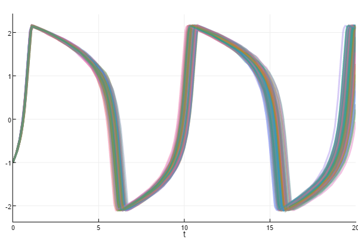
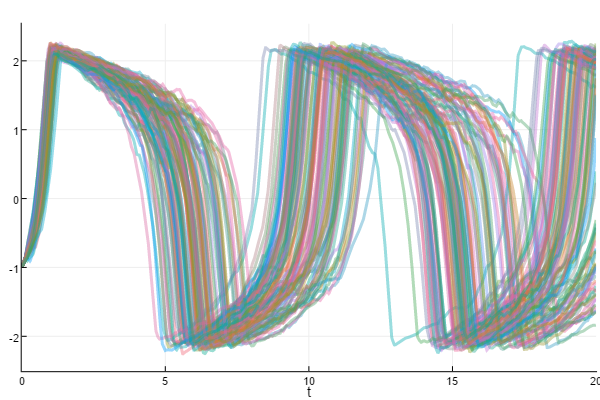
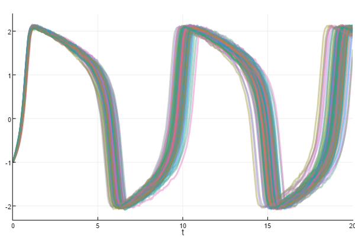
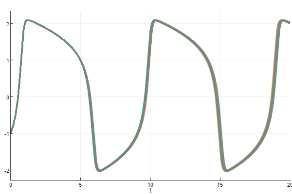
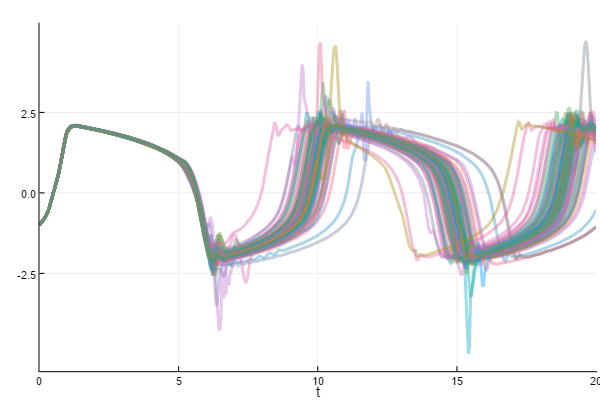
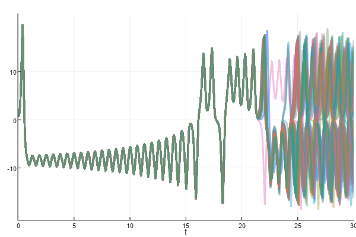
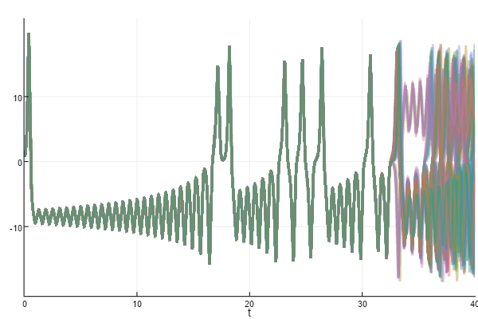

# Uncertainty Quantification

Uncertainty quantification allows a user to identify the uncertainty
associated with the numerical approximation given by DifferentialEquations.jl.
This page describes the different methods available for quantifying such
uncertainties.

## ProbInts

The [ProbInts](http://www2.warwick.ac.uk/fac/sci/statistics/staff/academic-research/girolami/probints)
method for uncertainty quantification involves the transformation of an ODE
into an associated SDE where the noise is related to the timesteps and the order
of the algorithm. This is implemented into the DiffEq system via a callback function.
The first form is:

```julia
ProbIntsUncertainty(σ,order,save=true)
```

`σ` is the noise scaling factor and `order` is the order of the algorithm. `save`
is for choosing whether this callback should control the saving behavior. Generally
this is true unless one is stacking callbacks in a `CallbackSet`. It is recommended
that `σ` is representative of the size of the errors in a single step of the equation.

If you are using an adaptive algorithm, the callback

```julia
AdaptiveProbIntsUncertainty(order,save=true)
```

determines the noise scaling automatically using an internal error estimate.

### Example 1: FitzHugh-Nagumo

In this example we will determine our uncertainty when solving the FitzHugh-Nagumo
model with the `Euler()` method. We define the FitzHugh-Nagumo model using the
`@ode_def` macro:

```julia
fitz = @ode_def_nohes FitzhughNagumo begin
  dV = c*(V - V^3/3 + R)
  dR = -(1/c)*(V -  a - b*R)
end a=0.2 b=0.2 c=3.0
u0 = [-1.0;1.0]
tspan = (0.0,20.0)
prob = ODEProblem(fitz,u0,tspan)
```

Now we define the `ProbInts` callback. In this case, our method is the `Euler`
method and thus it is order 1. For the noise scaling, we will try a few different
values and see how it changes. For `σ=0.2`, we define the callback as:

```julia
cb = ProbIntsUncertainty(0.2,1)
```

This is akin to having an error of approximately 0.2 at each step. We now build
and solve a [MonteCarloProblem](../features/monte_carlo.html) for 100 trajectories:

```julia
monte_prob = MonteCarloProblem(prob)
sim = solve(monte_prob,Euler(),num_monte=100,callback=cb,dt=1/10)
```

Now we can plot the resulting Monte Carlo solution:

```julia
using Plots; plotly(); plot(sim,vars=(0,1),linealpha=0.4)
```



If we increase the amount of error, we see that some parts of the
equation have less uncertainty than others. For example, at `σ=0.5`:

```julia
cb = ProbIntsUncertainty(0.5,1)
monte_prob = MonteCarloProblem(prob)
sim = solve(monte_prob,Euler(),num_monte=100,callback=cb,dt=1/10)
using Plots; plotly(); plot(sim,vars=(0,1),linealpha=0.4)
```



But at this amount of noise, we can see how we contract to the true solution by
decreasing `dt`:

```julia
cb = ProbIntsUncertainty(0.5,1)
monte_prob = MonteCarloProblem(prob)
sim = solve(monte_prob,Euler(),num_monte=100,callback=cb,dt=1/100)
using Plots; plotly(); plot(sim,vars=(0,1),linealpha=0.4)
```



## Example 2: Adaptive ProbInts on FitzHugh-Nagumo

While the first example is academic and shows how the ProbInts method
scales, the fact that one should have some idea of the error in order
to calibrate `σ` can lead to complications. Thus the more useful method
in many cases is the `AdaptiveProbIntsUncertainty` version. In this
version, no `σ` is required since this is calculated using an internal
error estimate. Thus this gives an accurate representation of the
possible error without user input.

Let's try this with the order 5 `Tsit5()` method on the same problem as before:

```julia
cb = AdaptiveProbIntsUncertainty(5)
sol = solve(prob,Tsit5())
monte_prob = MonteCarloProblem(prob)
sim = solve(monte_prob,Tsit5(),num_monte=100,callback=cb)
using Plots; plotly(); plot(sim,vars=(0,1),linealpha=0.4)
```



In this case, we see that the default tolerances give us a very good solution. However, if we increase the tolerance a lot:

```julia
cb = AdaptiveProbIntsUncertainty(5)
sol = solve(prob,Tsit5())
monte_prob = MonteCarloProblem(prob)
sim = solve(monte_prob,Tsit5(),num_monte=100,callback=cb,abstol=1e-3,reltol=1e-1)
using Plots; plotly(); plot(sim,vars=(0,1),linealpha=0.4)
```



we can see that the moments just after the rise can be uncertain.

## Example 3: Adaptive ProbInts on the Lorenz Attractor

One very good use of uncertainty quantification is on chaotic models. Chaotic
equations diverge from the true solution according to the error exponentially.
This means that as time goes on, you get further and further from the solution.
The `ProbInts` method can help diagnose how much of the timeseries is reliable.

As in the previous example, we first define the model:

```julia
g = @ode_def_bare LorenzExample begin
  dx = σ*(y-x)
  dy = x*(ρ-z) - y
  dz = x*y - β*z
end σ=>10.0 ρ=>28.0 β=(8/3)
u0 = [1.0;0.0;0.0]
tspan = (0.0,30.0)
prob = ODEProblem(g,u0,tspan)
```

and then we build the `ProbInts` type. Let's use the order 5 `Tsit5` again.

```julia
cb = AdaptiveProbIntsUncertainty(5)
```

Then we solve the `MonteCarloProblem`

```julia
monte_prob = MonteCarloProblem(prob)
sim = solve(monte_prob,Tsit5(),num_monte=100,callback=cb)
using Plots; plotly(); plot(sim,vars=(0,1),linealpha=0.4)
```



Here we see that by `t` about 22 we start to receive junk. We can increase
the amount of time before error explosion by using a higher order method
with stricter tolerances:

```julia
tspan = (0.0,40.0)
prob = ODEProblem(g,u0,tspan)
cb = AdaptiveProbIntsUncertainty(7)
monte_prob = MonteCarloProblem(prob)
sim = solve(monte_prob,Vern7(),num_monte=100,callback=cb,reltol=1e-6)
using Plots; plotly(); plot(sim,vars=(0,1),linealpha=0.4)
```



we see that we can extend the amount of time until we recieve junk.
