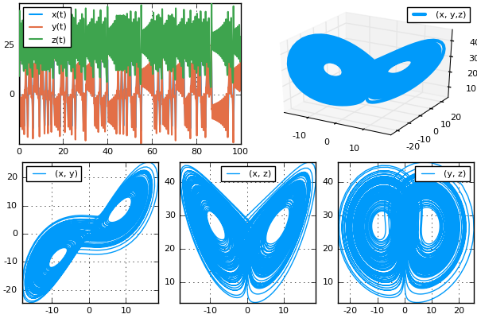
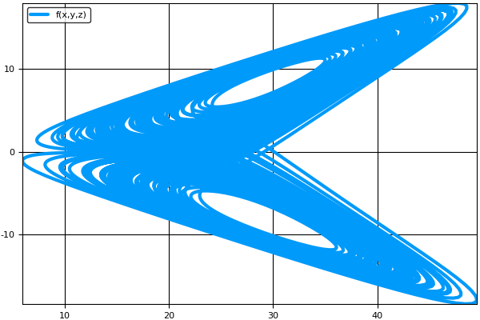

# Plot Functions

## Standard Plots

Plotting functionality is provided by recipes to Plots.jl. To
use plot solutions, simply call the `plot(type)` after importing Plots.jl
and the plotter will generate appropriate plots.

```julia
#Pkg.add("Plots") # You need to install Plots.jl before your first time using it!
using Plots
plot(sol) # Plots the solution
```

Many of the types defined in the DiffEq universe, such as
`ODESolution`, `ConvergenceSimulation` `WorkPrecision`, etc. have plot recipes
to handle the default plotting behavior. Plots can be customized using
[all of the keyword arguments provided by Plots.jl](https://juliaplots.github.io/supported/).
For example, we can change the plotting backend to the GR package and put a title
on the plot by doing:

```julia
gr()
plot(sol,title="I Love DiffEqs!")
```

## Density

If the problem was solved with `dense=true`, then `denseplot` controls whether
to use the dense function for generating the plot, and `plotdensity` is the number
of evenly-spaced points (in time) to plot. For example:

```julia
plot(sol,denseplot=false)
```

means "only plot the points which the solver stepped to", while:

```julia
plot(sol,plotdensity=1000)
```

means to plot 1000 points using the dense function (since `denseplot=true` by
default).

## Choosing Variables

In the plot command, one can choose the variables to be plotted in each plot. The
master form is:

```julia
vars = [(f1,0,1), (f2,1,3), (f3,4,5)]
```

where this would mean plot f1(variable 1, variable 2), f2(variable 1, variable 3),
f3(variable 4, variable 5) all on the same graph. (0 is considered to be time,
or the independent variable). The function `f1` should take in scalars and return
a tuple. If no function is given, for example,

```julia
vars = [(0,1), (1,3), (4,5)]
```

where this would mean plot variable 0 vs 1, 1 vs 3, and 4 vs 5 all on the same graph.
While this can be used for everything, the following conveniences are provided:

* Everywhere in a tuple position where we only find an integer, this
  variable is plotted as a function of time.  For example, the list above
  is equivalent to:

```julia
vars = [1, (1,3), (4,5)]
```

and

```julia
vars = [1, 3, 4]
```

is the most concise way to plot the variables 1, 3, and 4 as a function
of time.

* It is possible to omit the list if only one plot is wanted: `(2,3)`
  and `4` are respectively equivalent to `[(2,3)]` and `[(0,4)]`.

* A tuple containing one or several lists will be expanded by
  associating corresponding elements of the lists with each other:

```julia
vars = ([1,2,3], [4,5,6])
```

is equivalent to

```julia
vars = [(1,4), (2,5), (3,6)]
```

and

```julia
vars = (1, [2,3,4])
```

is equivalent to

```julia
vars = [(1,2), (1,3), (1,4)]
```

* Instead of using integers, one can use the symbols from a `ParameterizedFunction`.
  For example, `vars=(:x,:y)` will replace the symbols with the integer values for
  components `:x` and `:y`.

* n-dimensional groupings are allowed. For example, `(1,2,3,4,5)` would be a
  5-dimensional plot between the associated variables.

### Example

```julia
using DifferentialEquations, Plots
lorenz = @ode_def Lorenz begin
  dx = σ*(y-x)
  dy = ρ*x-y-x*z
  dz = x*y-β*z
end σ = 10. β = 8./3. ρ => 28.

u0 = [1., 5., 10.]
tspan = (0., 100.)
prob = ODEProblem(lorenz, u0, tspan)
sol = solve(prob)

xyzt = plot(sol, plotdensity=10000,lw=1.5)
xy = plot(sol, plotdensity=10000, vars=(:x,:y))
xz = plot(sol, plotdensity=10000, vars=(:x,:z))
yz = plot(sol, plotdensity=10000, vars=(:y,:z))
xyz = plot(sol, plotdensity=10000, vars=(:x,:y,:z))
plot(plot(xyzt,xyz),plot(xy, xz, yz, layout=(1,3),w=1), layout=(2,1))
```



An example using the functions:

```julia
f(x,y,z) = (sqrt(x^2+y^2+z^2),x)
plot(sol,vars=(f,:x,:y,:z))
```



## Animations

Using the iterator interface over the solutions, animations can also be generated
via the `animate(sol)` command. One can choose the `filename` to save to via
`animate(sol,filename)`, while the frames per second `fps` and the density of steps
to show `every` can be specified via keyword arguments.
The rest of the arguments will be directly passed to the plot recipe to be handled
as normal. For example, we can animate our solution with a larger line-width which
saves every 4th frame via:

```julia
animate(sol,lw=3,every=4)
```

Please see [Plots.jl's documentation](https://juliaplots.github.io/) for more information
on the available attributes.
