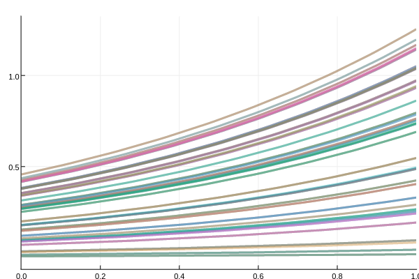
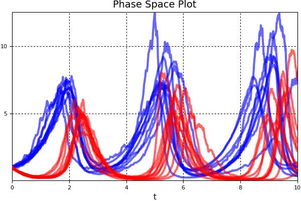
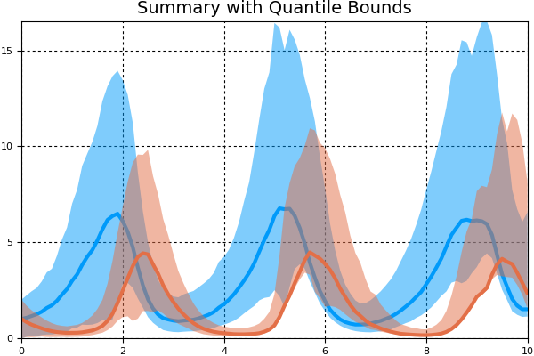
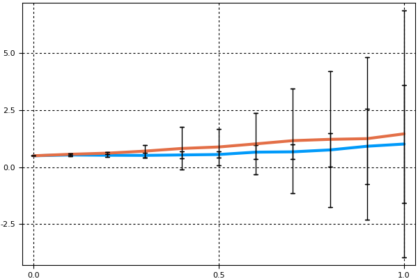
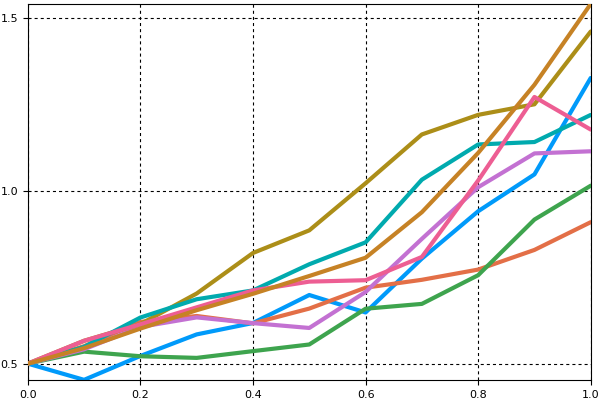

# Parallel Monte Carlo Simulations

## Performing a Monte Carlo Simulation

### Building a Problem

To perform a Monte Carlo simulation, define a `MonteCarloProblem`. The constructor is:

```julia
MonteCarloProblem(prob::DEProblem;
                  output_func = (sol,i) -> sol,
                  prob_func= (prob,i)->prob),
                  reduction = (u,data,I)->(append!(u,data),false),
                  u_init = [])
```

* `prob_func`: The function by which the problem is to be modified.
* `output_func`: The function determines what is saved from the solution to the
  output array. Defaults to saving the solution itself.
* `reduction`: This function determines how to reduce the data in each batch.
  Defaults to appending the data from the batches. The second part of the output
  determines whether the simulation has converged. If `true`, the simulation
  will exit early. By default, this is always `false`.

One can specify a function `prob_func` which changes the problem. For example:

```julia
function prob_func(prob,i)
  prob.u0 = randn()*prob.u0
  prob
end
```

modifies the initial condition for all of the problems by a standard normal
random number (a different random number per simulation). This can be used
to perform searches over initial values. Note that the parameter `i` is a unique
counter over the simulations. Thus if you have an array of initial conditions `u0_arr`,
you can have the `i`th simulation use the `i`th initial condition via:

```julia
function prob_func(prob,i)
  prob.u0 = u0_arr[i]
  prob
end
```

If your function is a `ParameterizedFunction`,
you can do similar modifications to `prob.f` to perform a parameter search. The `output_func`
is a reduction function. It's arguments are the generated solution and the unique
index for the run. For example, if we wish to only save the 2nd coordinate
at the end of each solution, we can do:

```julia
output_func(sol,i) = sol[end,2]
```

Thus the Monte Carlo Simulation would return as its data an array which is the
end value of the 2nd dependent variable for each of the runs.

### Parameterizing the Monte Carlo Components

The Monte Carlo components can be parameterized by using the `ConcreteParameterizedFunction`
constructors.

```julia
ProbParameterizedFunction(prob_func,params)
OutputParameterizedFunction(output_func,params)
```

Here, the signatures are `prob_func(prob,i,params)` and `output_func(sol,params)`.
These parameters are added to the parameter list for use in the parameter estimation
schemes.

### Solving the Problem

```julia
sim = solve(prob,alg,collect_result = Val{true},kwargs...)
```

This solve command has an extra keyword argument `collect_result` for whether to
collect the result to a local array. If `Val{true}`, it will return a `Vector`
of the results of `output_func`. If `Val{false}`, it will run each batch
independently to form a `DArray`. Notice that `parallel_type` would be a layer
of parallelism below this.

The keyword arguments take in the arguments for the common solver interface and will
pass them to the differential equation solver. The special keyword arguments to note are:

* `num_monte`: The number of simulations to run. Default is 10,000.
* `parallel_type` : The type of parallelism to employ. Default is `:pmap` if
  `collect_result`, otherwise it's `none`.
* `batch_size` : The size of the batches on which the reductions are applies. Defaults to `num_monte`.
* `pmap_batch_size`: The size of the `pmap` batches. Default is
   `batch_size÷100 > 0 ? batch_size÷100 : 1`

The types of parallelism included are:

* `:none` - No parallelism
* `:threads` - This uses multithreading. It's local (single computer, shared memory)
  parallelism only. Fastest when the trajectories are quick.
* `:parfor` - A multiprocessing parallelism. Slightly better than `pmap` when the
  calculations are fast. Does not re-distribute work: each trajectory is assumed
  to take as long to calculate.
* `:pmap` - The default. Uses `pmap` internally. It will use as many processors as you
  have Julia processes. To add more processes, use `addprocs(n)`. See Julia's
  documentation for more details. Recommended for the case when each trajectory
  calculation isn't "too quick" (at least about a millisecond each?).
* `:split_threads` - This uses threading on each process, splitting the problem
  into `nprocs()` even parts. This is for solving many quick trajectories on a
  multi-node machine. It's recommended you have one process on each node.

Additionally, a `MonteCarloEstimator` can be supplied

```julia
sim = solve(prob,estimator,alg,kwargs...)
```

These will be detailed when implemented.

### Solution Type

The resulting type is a `MonteCarloSimulation`, which includes the array of
solutions. If the problem was a `TestProblem`, summary statistics on the errors
are returned as well.

### Plot Recipe

There is a plot recipe for a `AbstractMonteCarloSimulation` which composes all
of the plot recipes for the component solutions. The keyword arguments are passed
along. A useful argument to use is `linealpha` which will change the transparency
of the plots. An additional argument is `idxs` which allows you to choose which
components of the solution to plot. For example, if the differential equation
is a vector of 9 values, `idxs=1:2:9` will plot only the Monte Carlo solutions
of the odd components.

## Analyzing a Monte Carlo Experiment

Analysis tools are included for generating summary statistics and summary plots
for a `MonteCarloSimulation`.

### Time steps vs time points

For the summary statistics, there are two types. You can either summarize by
time steps or by time points. Summarizing by time steps assumes that the time steps
are all the same time point, i.e. the integrator used a fixed `dt` or the values were
saved using `saveat`. Summarizing by time points requires interpolating the solution.

### Analysis at a time step or time point

```julia
get_timestep(sim,i) # Returns an iterator of each simulation at time step i
get_timepoint(sim,t) # Returns an iterator of each simulation at time point t
componentwise_vectors_timestep(sim,i) # Returns a vector of each simulation at time step i
componentwise_vectors_timepoint(sim,t) # Returns a vector of each simulation at time point t
```

### Summary Statistics

#### Single Time Statistics

The available functions for time steps are:

```julia
timestep_mean(sim,i) # Computes the mean of each component at time step i
timestep_median(sim,i) # Computes the median of each component at time step i
timestep_quantile(sim,q,i) # Computes the quantile q of each component at time step i
timestep_meanvar(sim,i)  # Computes the mean and variance of each component at time step i
timestep_meancov(sim,i,j) # Computes the mean at i and j, and the covariance, for each component
timestep_meancor(sim,i,j) # Computes the mean at i and j, and the correlation, for each component
timestep_weighted_meancov(sim,W,i,j) # Computes the mean at i and j, and the weighted covariance W, for each component
```

The available functions for time points are:

```julia
timepoint_mean(sim,t) # Computes the mean of each component at time t
timepoint_median(sim,t) # Computes the median of each component at time t
timepoint_quantile(sim,q,t) # Computes the quantile q of each component at time t
timepoint_meanvar(sim,t) # Computes the mean and variance of each component at time t
timepoint_meancov(sim,t1,t2) # Computes the mean at t1 and t2, the covariance, for each component
timepoint_meancor(sim,t1,t2) # Computes the mean at t1 and t2, the correlation, for each component
timepoint_weighted_meancov(sim,W,t1,t2) # Computes the mean at t1 and t2, the weighted covariance W, for each component
```

#### Full Timeseries Statistics

Additionally, the following functions are provided for analyzing the full timeseries.
The `mean` and `meanvar` versions return a `DiffEqArray` which can be directly plotted.
The `meancov` and `meancor` return a matrix of tuples, where the tuples are the
`(mean_t1,mean_t2,cov or cor)`.

The available functions for the time steps are:

```julia
timeseries_steps_mean(sim) # Computes the mean at each time step
timeseries_steps_median(sim) # Computes the median at each time step
timeseries_steps_quantile(sim,q) # Computes the quantile q at each time step
timeseries_steps_meanvar(sim) # Computes the mean and variance at each time step
timeseries_steps_meancov(sim) # Computes the covariance matrix and means at each time step
timeseries_steps_meancor(sim) # Computes the correlation matrix and means at each time step
timeseries_steps_weighted_meancov(sim) # Computes the weighted covariance matrix and means at each time step
```

The available functions for the time points are:

```julia
timeseries_point_mean(sim,ts) # Computes the mean at each time point in ts
timeseries_point_median(sim,ts) # Computes the median at each time point in ts
timeseries_point_quantile(sim,q,ts) # Computes the quantile q at each time point in ts
timeseries_point_meanvar(sim,ts) # Computes the mean and variance at each time point in ts
timeseries_point_meancov(sim,ts) # Computes the covariance matrix and means at each time point in ts
timeseries_point_meancor(sim,ts) # Computes the correlation matrix and means at each time point in ts
timeseries_point_weighted_meancov(sim,ts) # Computes the weighted covariance matrix and means at each time point in ts
```

### MonteCarloSummary

The `MonteCarloSummary` type is included to help with analyzing the general summary
statistics. Two constructors are provided:

```julia
MonteCarloSummary(sim;quantile=[0.05,0.95])
MonteCarloSummary(sim,ts;quantile=[0.05,0.95])
```

The first produces a `(mean,var)` summary at each time step. As with the summary
statistics, this assumes that the time steps are all the same. The second produces
a `(mean,var)` summary at each time point `t` in `ts`. This requires the ability
to interpolate the solution. Quantile is used to determine the `qlow` and `qhigh`
quantiles at each timepoint. It defaults to the 5% and 95% quantiles.

#### Plot Recipe

The `MonteCarloSummary` comes with a plot recipe for visualizing the summary
statistics. The extra keyword arguments are:

- `idxs`: the solution components to plot. Defaults to plotting all components.
- `error_style`: The style for plotting the error. Defaults to `ribbon`. Other
  choices are `:bars` for error bars and `:none` for no error bars.
- `ci_type` : Defaults to `:quantile` which has `(qlow,qhigh)` quantiles
  whose limits were determined when constructing the `MonteCarloSummary`.
  Gaussian CI `1.96*(standard error of the mean)` can be set using `ci_type=:SEM`.

One useful argument is `fillalpha` which controls the transparency of the ribbon
around the mean.

## Example 1: Solving an ODE With Different Initial Conditions

### Random Initial Conditions

Let's test the sensitivity of the linear ODE to its initial condition. To do this,
we would like to solve the linear ODE 100 times and plot what the trajectories
look like. Let's start by opening up some extra processes so that way the computation
will be parallelized:

```julia
addprocs()
using DifferentialEquations
```

Now let's define the linear ODE which is our base problem:

```julia
# Linear ODE which starts at 0.5 and solves from t=0.0 to t=1.0
prob = ODEProblem((t,u)->1.01u,0.5,(0.0,1.0))
```

For our Monte Carlo simulation, we would like to change the initial condition around.
This is done through the `prob_func`. This function takes in the base problem
and modifies it to create the new problem that the trajectory actually solves.
Here we will take the base problem, multiply the initial condition by a `rand()`,
and use that for calculating the trajectory:

```julia
prob_func = function (prob,i)
  prob.u0 = rand()*prob.u0
  prob
end
```

Now we build and solve the `MonteCarloProblem` with this base problem and `prob_func`:

```julia
monte_prob = MonteCarloProblem(prob,prob_func=prob_func)
sim = solve(monte_prob,Tsit5(),num_monte=100)
```

We can use the plot recipe to plot what the 100 ODEs look like:

```julia
using Plots
plotly()
plot(sim,linealpha=0.4)
```



We note that if we wanted to find out what the initial condition was for a given
trajectory, we can retrieve it from the solution. `sim[i]` returns the `i`th
solution object. `sim[i].prob` is the problem that specific trajectory solved,
and `sim[i].prob.u0` would then be the initial condition used in the `i`th
trajectory.

### Pre-Determined Initial Conditions

In many cases, you may already know what initial conditions you want to use. This
can be specified by the `i` argument of the `prob_func`. This `i` is the unique
index of each trajectory. So, if we have `num_monte=100`, then we have `i` as
some index in `1:100`, and it's different for each trajectory.

So, if we wanted to use a grid of evenly spaced initial conditions from `0` to `1`,
we could simply index the `linspace` type:

```julia
initial_conditions = linspace(0,1,100)
prob_func = function (prob,i)
  prob.u0 = initial_conditions[i]
  prob
end
```

## Example 2: Solving an SDE with Different Parameters

### Using the Parameterized Function Wrappers

Let's solve the same SDE but with varying parameters. Instead of using the macro,
we will use [the parameterized function wrappers](../analysis/parameterized_functions.html)
(though either can be used). Let's create a Lotka-Volterra system with multiplicative
noise. Our Lotka-Volterra system will have as its drift component:

```julia
pf_func = function (t,u,p,du)
  du[1] = p[1] * u[1] - p[2] * u[1]*u[2]
  du[2] = -3 * u[2] + u[1]*u[2]
end
pf = ParameterizedFunction(pf_func,[1.5,1.0])
```

where `pf` is the function with the parameters `1.5` and `1.0` associated with it.
For our noise function we will use multiplicative noise:

```julia
pg_func = function (t,u,p,du)
  du[1] = p[1]*u[1]
  du[2] = p[2]*u[2]
end
pg = ParameterizedFunction(pg_func,[0.1,0.1])
```

Now we build the SDE with these functions:

```julia
prob = SDEProblem(pf,pg,[1.0,1.0],(0.0,10.0))
```

This is the base problem for our study. What would like to do with this experiment
is keep the same parameters in the deterministic component each time, but very
the parameters for the amount of noise using `0.3rand(2)` as our parameters.
Once again, we do this with a `prob_func`. In a `ParameterizedFunction` `f`, the
parameters are accessed at `f.params`. Thus we will modify those values in the
`prob_func`. Note that in the `SDEProblem`, the noise function is referred to as
`g`:

```julia
prob_func = function (prob,i)
  set_param_values!(prob.g,0.3rand(2))
  prob
end
```

Now we solve the problem 10 times and plot all of the trajectories in phase space:

```julia
monte_prob = MonteCarloProblem(prob,prob_func=prob_func)
sim = solve(monte_prob,SRIW1(),num_monte=10)
using Plots; plotly()
using Plots; plot(sim,linealpha=0.6,color=:blue,vars=(0,1),title="Phase Space Plot")
plot!(sim,linealpha=0.6,color=:red,vars=(0,2),title="Phase Space Plot")
```



We can then summarize this information with the mean/variance bounds using a
`MonteCarloSummary` plot. We will take the mean/quantile at every `0.1` time
units and directly plot the summary:

```julia
summ = MonteCarloSummary(sim,0:0.1:10)
pyplot() # Note that plotly does not support ribbon plots
plot(summ,fillalpha=0.5)
```



Note that here we used the quantile bounds, which default to `[0.05,0.95]` in
the `MonteCarloSummary` constructor. We can change to standard error of the mean
bounds using `ci_type=:SEM` in the plot recipe.

## Example 3: Using the Reduction to Halt When Estimator is Within Tolerance

In this problem we will solve the equation just as many times as needed to get
the standard error of the mean for the final time point below our tolerance
`0.5`. Since we only care about the endpoint, we can tell the `output_func`
to discard the rest of the data.

```julia
output_func = function (sol,i)
  last(sol)
end
```

Our `prob_func` wull simply randomize the initial condition:

```julia
# Linear ODE which starts at 0.5 and solves from t=0.0 to t=1.0
prob = ODEProblem((t,u)->1.01u,0.5,(0.0,1.0))

prob_func = function (prob,i)
  prob.u0 = rand()*prob.u0
  prob
end
```

Our reduction function will append the data from the current batch to the previous
batch, and declare convergence if the standard error of the mean is calculated
as sufficiently small:

```julia
reduction = function (u,batch,I)
  u = append!(u,batch)
  u,((var(u)/sqrt(last(I)))/mean(u)<0.5)?true:false
end
```

Then we can define and solve the problem:

```julia
prob2 = MonteCarloProblem(prob,prob_func=prob_func,output_func=output_func,reduction=reduction,u_init=Vector{Float64}())
sim = solve(prob2,Tsit5(),num_monte=10000,batch_size=20)
```

Since `batch_size=20`, this means that every 20 simulations, it will take this batch,
append the results to the previous batch, calculate `(var(u)/sqrt(last(I)))/mean(u)`,
and if that's small enough, exit the simulation. In this case, the simulation
exits only after 20 simulations (i.e. after calculating the first batch). This
can save a lot of time!

In addition to saving time by checking convergence, we can save memory by reducing
between batches. For example, say we only care about the mean at the end once
again. Instead of saving the solution at the end for each trajectory, we can instead
save the running summation of the endpoints:

```julia
reduction = function (u,batch,I)
  u+sum(batch),false
end
prob2 = MonteCarloProblem(prob,prob_func=prob_func,output_func=output_func,reduction=reduction,u_init=0.0)
sim2 = solve(prob2,Tsit5(),num_monte=100,batch_size=20)
```

this will sum up the endpoints after every 20 solutions, and save the running sum.
The final result will have `sim2.u` as simply a number, and thus `sim2.u/100` would
be the mean.

## Example 4: Using the Analysis Tools

In this example we will show how to analyze a `MonteCarloSolution`. First, let's
generate a 10 solution Monte Carlo experiment. For our problem we will use a `4x2`
system of linear stochastic differential equations:

```julia
f = (t,u,du) -> begin
  for i = 1:length(u)
    du[i] = 1.01*u[i]
  end
end
σ = (t,u,du) -> begin
  for i in 1:length(u)
    du[i] = .87*u[i]
  end
end
prob = SDEProblem(f,σ,ones(4,2)/2,(0.0,1.0)) #prob_sde_2Dlinear
```

To solve this 10 times, we use the `MonteCarloProblem` constructor and solve
with `num_monte=10`. Since we wish to compare values at the timesteps, we need
to make sure the steps all hit the same times. Thus we set `adaptive=false` and
explicitly give a `dt`.

```julia
prob2 = MonteCarloProblem(prob)
sim = solve(prob2,SRIW1(),dt=1//2^(3),num_monte=10,adaptive=false)
```

**Note that if you don't do the `timeseries_steps` calculations, this code is
compatible with adaptive timestepping. Using adaptivity is usually more efficient!**

We can compute the mean and the variance at the 3rd timestep using:

```julia
m,v = timestep_meanvar(sim,3)
```

or we can compute the mean and the variance at the `t=0.5` using:

```julia
m,v = timepoint_meanvar(sim,0.5)
```

We can get a series for the mean and the variance at each time step using:

```julia
m_series,v_series = timeseries_steps_meanvar(sim)
```

or at chosen values of `t`:

```julia
ts = 0:0.1:1
m_series = timeseries_point_mean(sim,ts)
```

Note that these mean and variance series can be directly plotted. We can
compute covariance matrices similarly:

```julia
timeseries_steps_meancov(sim) # Use the time steps, assume fixed dt
timeseries_point_meancov(sim,0:1//2^(3):1,0:1//2^(3):1) # Use time points, interpolate
```

For general analysis, we can build a `MonteCarloSummary` type.

```julia
summ = MonteCarloSummary(sim)
```

will summarize at each time step, while

```julia
summ = MonteCarloSummary(sim,0.0:0.1:1.0)
```

will summarize at the `0.1` time points using the interpolations. To
visualize the results we can plot it. Since there are 8 components to
the differential equation, this can get messy, so let's only plot the
3rd component:

```julia
plot(summ;idxs=3)
```


We can change to errorbars instead of ribbons and plot two different
indices:

```julia
plot(summ;idxs=(3,5),error_style=:bars)
```



Or we can simply plot the mean of every component over time:

```julia
plot(summ;error_style=:none)
```


