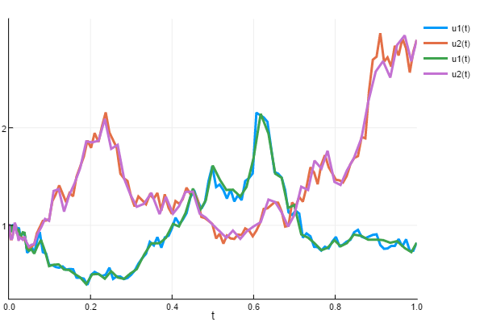

# Noise Processes

A `NoiseProcess` is a type defined as

```julia
NoiseProcess(t0,W0,Z0,dist,bridge;
             iip=DiffEqBase.isinplace(dist,3),
             rswm = RSWM())
```

- `t0` is the first timepoint
- `W0` is the first value of the process.
- `Z0` is the first value of the psudo-process. This is necessary for higher
  order algorithms. If it's not needed, set to `nothing`.
- `dist` the distribution for the steps over time.
- `bridge` the bridging distribution. Optional, but required for adaptivity and interpolating
  at new values.

The signature for the `dist` is

```julia
dist!(rand_vec,W,dt)
```

for inplace functions, and

```julia
rand_vec = dist(W,dt)
```

otherwise. The signature for `bridge` is

```julia
bridge!(rand_vec,W,W0,Wh,q,h)
```

and the out of place syntax is

```julia
rand_vec = bridge!(W,W0,Wh,q,h)
```

Here, `W` is the noise process, `W0` is the left side of the current interval,
`Wh` is the right side of the current interval, `h` is the interval length,
and `q` is the proportion from the left where the interpolation is occuring.


### White Noise

The default noise is `WHITE_NOISE`. This is the noise process which uses `randn!`.
A special dispatch is added for complex numbers for `(randn()+im*randn())/sqrt(2)`.
This function is `DiffEqBase.wiener_randn` (or with `!` respectively). Thus
its noise function is essentially:

```julia
function WHITE_NOISE_DIST(W,dt)
  if typeof(W.dW) <: AbstractArray
    return sqrt(abs(dt))*wiener_randn(size(W.dW))
  else
    return sqrt(abs(dt))*wiener_randn(typeof(W.dW))
  end
end
function WHITE_NOISE_BRIDGE(W,W0,Wh,q,h)
  sqrt((1-q)*q*abs(h))*wiener_randn(typeof(W.dW))+q*(Wh-W0)+W0
end
```

for the out of place versions, and for the inplace versions

```julia
function INPLACE_WHITE_NOISE_DIST(rand_vec,W,dt)
  wiener_randn!(rand_vec)
  rand_vec .*= sqrt(abs(dt))
end
function INPLACE_WHITE_NOISE_BRIDGE(rand_vec,W,W0,Wh,q,h)
  wiener_randn!(rand_vec)
  rand_vec .= sqrt((1.-q).*q.*abs(h)).*rand_vec.+q.*(Wh.-W0).+W0
end
```

Notice these functions correspond to the distributions for the Wiener process,
that is the first one is simply that Brownian steps are distributed `N(0,dt)`,
while the second function is the distribution of the Brownian Bridge `N(q(Wh-W0)+W0,(1-q)qh)`.
These functions are then placed in a noise process:

```julia
NoiseProcess(t0,W0,Z0,WHITE_NOISE_DIST,WHITE_NOISE_BRIDGE,rswm=RSWM())
NoiseProcess(t0,W0,Z0,INPLACE_WHITE_NOISE_DIST,INPLACE_WHITE_NOISE_BRIDGE,rswm=RSWM())
```

For convenience, the following constructors are predefined:

```julia
WienerProcess(t0,W0,Z0=nothing) = NoiseProcess(t0,W0,Z0,WHITE_NOISE_DIST,WHITE_NOISE_BRIDGE,rswm=RSWM())
WienerProcess!(t0,W0,Z0=nothing) = NoiseProcess(t0,W0,Z0,INPLACE_WHITE_NOISE_DIST,INPLACE_WHITE_NOISE_BRIDGE,rswm=RSWM())
```

These will generate a Wiener process, which can be stepped with `step!(W,dt)`, and interpolated as `W(t)`.

### Correlated Noise

One can define a `CorrelatedWienerProcess` which is a Wiener process with correlations between the Wiener processes. The constructor is:

```julia
CorrelatedWienerProcess(Γ,t0,W0,Z0=nothing)
CorrelatedWienerProcess!(Γ,t0,W0,Z0=nothing)
```

where `Γ` is the constant covariance matrix.

### NoiseWrapper

Another `AbstractNoiseProcess` is the `NoiseWrapper`. This produces a new
noise process from an old one, which will use its interpolation to generate
the noise. This allows you to re-use a previous noise process not just with
the same timesteps, but also with new (adaptive) timesteps as well. Thus
this is very good for doing Multi-level Monte Carlo schemes and strong
convergence testing.

To wrap a noise process, simply use:

```julia
NoiseWrapper(W::NoiseProcess)
```

#### Example

In this example, we will solve an SDE three times:

- First to generate a noise process
- Second with the same timesteps to show the values are the same
- Third with half-sized timsteps

First we will generate a noise process by solving an SDE:

```julia
using StochasticDiffEq,  DiffEqBase, DiffEqNoiseProcess, Base.Test
f1 = (t,u) -> 1.01u
g1 = (t,u) -> 1.01u
dt = 1//2^(4)
prob1 = SDEProblem(f1,g1,1.0,(0.0,1.0))
sol1 = solve(prob1,EM(),dt=dt)
```

Now we wrap the noise into a NoiseWrapper and solve the same problem:

```julia
W2 = NoiseWrapper(sol1.W)
prob1 = SDEProblem(f1,g1,1.0,(0.0,1.0),noise=W2)
sol2 = solve(prob1,EM(),dt=dt)
```

We can test

```julia
@test sol1.u ≈ sol2.u
```

to see that the values are essentially equal. Now we can use the same process
to solve the same trajectory with a smaller `dt`:

```julia
W3 = NoiseWrapper(sol1.W)
prob2 = SDEProblem(f1,g1,1.0,(0.0,1.0),noise=W3)

dt = 1//2^(5)
sol3 = solve(prob2,EM(),dt=dt)
```

We can plot the results to see what this looks like:

```julia
using Plots
plot(sol1)
plot!(sol2)
plot!(sol3)
```


In this plot, `sol2` covers up `sol1` because they hit essentially the same
values. You can see that `sol3` its similar to the others, because it's
using the same underlying noise process just sampled much finer.

To double check, we see that:

```julia
plot(sol1.W)
plot!(sol2.W)
plot!(sol3.W)
```

[coupled_wiener](../assets/coupled_wiener.png)

the coupled Wiener processes coincide at every other timepoint, and the intermediate
timepoints were calculated according to a Brownian bridge.


#### Adaptive Example

Here we will show that the same noise can be used with the adaptive methods
using the `NoiseWrapper`. `SRI` and `SRIW1` use slightly different error
estimators, and thus give slightly different stepping behavior. We can
see how they solve the same 2D SDE differently by using the noise
wrapper:

```julia
prob = SDEProblem(f1,g1,ones(2),(0.0,1.0))
sol4 = solve(prob,SRI(),abstol=1e-8)

W2 = NoiseWrapper(sol4.W)
prob2 = SDEProblem(f1,g1,ones(2),(0.0,1.0),noise=W2)
sol5 = solve(prob2,SRIW1(),abstol=1e-8)

using Plots
plot(sol4)
plot!(sol5)
```


