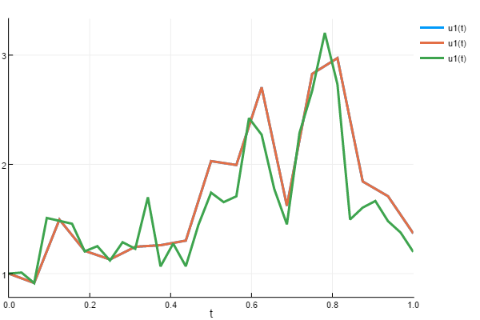
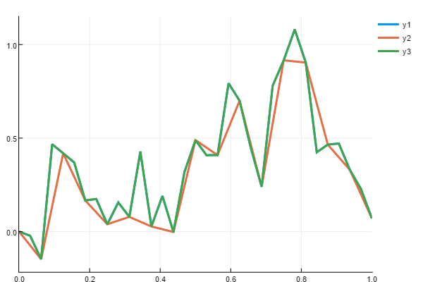

# Noise Processes

Noise processes are essential in continuous stochastic modeling. The noise processes
defined here are distributionally-exact, meaning they are not solutions of
stochastic differential equations and instead are directly generated according
to their analytical distributions. These processes are used as the noise term
in the SDE and RODE solvers. Additionally, the noise processes themselves can
be simulated and solved using the DiffEq common interface (including the Monte
Carlo interface).

This page first describes how to analyze and simulate noise processes, and then
describes the standard noise processes which are available. Then it is shown
how one can define the distributions for a new noise process. Then, some practice
usage is shown. It is demonstrated how the `NoiseWrapper` can be used to wrap
the `NoiseProcess` of one SDE/RODE solution in order to re-use the same noise
process in another simulation.

## Noise Process Interface

### Basic Interface

The `NoiseProcess` acts like a DiffEq solution. For some noise process `W`, you
can get its `i`th timepoint like `W[i]` and the associated time `W.t[i]`. If the
`NoiseProcess` has a bridging distribution defined, it can be interpolated to
arbitrary time points using `W(t)`. Note that every interpolated value is saved
to the `NoiseProcess` so that way it can stay distributionally correct. A plot
recipe is provided which plots the timeseries.

### Direct Simulation of the Noise Process

Since the `NoiseProcess` types are distribution-exact and do not require the
stochastic differential equation solvers, many times one would like to directly
simulate trajectories from these proecesses. The `NoiseProcess` has a
`NoiseProcessProblem` type:

```julia
NoiseProblem(noise,tspan)
```

for which `solve` works. For example, we can simulate a distributionally-exact
Geometric Brownian Motion solution by:

```julia
μ = 1.0
σ = 2.0
W = GeometricBrownianMotionProcess(μ,σ,0.0,1.0,1.0)
prob = NoiseProblem(W,(0.0,1.0))
sol = solve(prob;dt=0.1)
```

`solve` requires the `dt` is given, the solution it returns is a `NoiseProcess`
which has stepped through the timespan. Because this follows the common interface,
all of the normal functionality works. For example, we can use the Monte Carlo
functionality as follows:

```julia
monte_prob = MonteCarloProblem(prob)
sol = solve(monte_prob;dt=0.1,num_monte=100)
```

simulates 100 Geometric Brownian Motions.

### Direct Interface

Most of the time, a `NoiseProcess` is received from the solution of a stochastic
or random differential equation, in which case `sol.W` gives the `NoiseProcess`
and it is already defined along some timeseries. In other cases, `NoiseProcess`
types are directly simulated (see below). However, `NoiseProcess` types can also
be directly acted on. The basic functionality is given by `calculate_step!`
to calculate a future time point, and `accept_step!` to accept the step. If steps
are rejected, the Rejection Sampling with Memory algorithm is applied to keep
the solution distributionally exact. This kind of stepping is done via:

```julia
W = WienerProcess(0.0,1.0,1.0)
dt = 0.1
calculate_step!(W,dt)
for i in 1:10
  accept_step!(W,dt)
end
```

## Noise Process Types

This section describes the available `NoiseProcess` types.

### Wiener Process (White Noise)

The `WienerProcess`, also known as Gaussian white noise, Brownian motion, or
the noise in the Langevin equation, is the stationary process with distribution
`N(0,t)`. The constructor is:

```julia
WienerProcess(t0,W0,Z0=nothing)
WienerProcess!(t0,W0,Z0=nothing)
```

### Correlated Noise

One can define a `CorrelatedWienerProcess` which is a Wiener process with
correlations between the Wiener processes. The constructor is:

```julia
CorrelatedWienerProcess(Γ,t0,W0,Z0=nothing)
CorrelatedWienerProcess!(Γ,t0,W0,Z0=nothing)
```

where `Γ` is the constant covariance matrix.

### Geometric Brownian Motion

A `GeometricBrownianMotion` process is a Wiener process with
constant drift `μ` and constant diffusion `σ`. I.e. this is the solution of the
stochastic differential equation

```math
dX_t = \mu X_t dt + \sigma X_t dW_t
```

The `GeometricBrownianMotionProcess` is distribution exact (meaning, not a numerical
solution of the stochastic differential equation, and instead follows the exact
distribution properties). It can be back interpolated exactly as well. The constructor is:

```julia
GeometricBrownianMotionProcess(μ,σ,t0,W0,Z0=nothing)
GeometricBrownianMotionProcess!(μ,σ,t0,W0,Z0=nothing)
```

### Ornstein-Uhlenbeck

One can define a `Ornstein-Uhlenbeck` process which is a Wiener process defined
by the stochastic differential equation

```math
dX_t = \theta (\mu - X_t) dt + \sigma X_t dW_t
```

The `OrnsteinUhlenbeckProcess` is distribution exact (meaning, not a numerical
solution of the stochastic differential equation, and instead follows the exact
distribution properties). The constructor is:

```julia
OrnsteinUhlenbeckProcess(Θ,μ,σ,t0,W0,Z0=nothing)
OrnsteinUhlenbeckProcess!(Θ,μ,σ,t0,W0,Z0=nothing)
```

### NoiseWrapper

Another `AbstractNoiseProcess` is the `NoiseWrapper`. This produces a new
noise process from an old one, which will use its interpolation to generate
the noise. This allows you to re-use a previous noise process not just with
the same timesteps, but also with new (adaptive) timesteps as well. Thus
this is very good for doing Multi-level Monte Carlo schemes and strong
convergence testing.

To wrap a noise process, simply use:

```julia
NoiseWrapper(W::NoiseProcess)
```

### Direct Construction of a Noise Process

A `NoiseProcess` is a type defined as

```julia
NoiseProcess(t0,W0,Z0,dist,bridge;
             iip=DiffEqBase.isinplace(dist,3),
             rswm = RSWM())
```

- `t0` is the first timepoint
- `W0` is the first value of the process.
- `Z0` is the first value of the psudo-process. This is necessary for higher
  order algorithms. If it's not needed, set to `nothing`.
- `dist` the distribution for the steps over time.
- `bridge` the bridging distribution. Optional, but required for adaptivity and interpolating
  at new values.

The signature for the `dist` is

```julia
dist!(rand_vec,W,dt)
```

for inplace functions, and

```julia
rand_vec = dist(W,dt)
```

otherwise. The signature for `bridge` is

```julia
bridge!(rand_vec,W,W0,Wh,q,h)
```

and the out of place syntax is

```julia
rand_vec = bridge!(W,W0,Wh,q,h)
```

Here, `W` is the noise process, `W0` is the left side of the current interval,
`Wh` is the right side of the current interval, `h` is the interval length,
and `q` is the proportion from the left where the interpolation is occuring.

### Direct Construction Example

The easiest way to show how to directly construct a `NoiseProcess` is by example.
Here we will show how to directly construct a `NoiseProcess` which generates
Gaussian white noise.

This is the noise process which uses `randn!`. A special dispatch is added for
complex numbers for `(randn()+im*randn())/sqrt(2)`. This function is
`DiffEqBase.wiener_randn` (or with `!` respectively).

The first function that must be defined is the noise distribution. This is how
to generate ``W(t+dt)`` given that we know ``W(x)`` for ``x∈[t₀,t]``. For Gaussian
white noise, we know that

```math
W(dt) ∼ N(0,dt)
```

for ``W(0)=0`` which defines the stepping distribution. Thus its noise distribution
function is:

```julia
function WHITE_NOISE_DIST(W,dt)
  if typeof(W.dW) <: AbstractArray
    return sqrt(abs(dt))*wiener_randn(size(W.dW))
  else
    return sqrt(abs(dt))*wiener_randn(typeof(W.dW))
  end
end
```

for the out of place versions, and for the inplace versions

```julia
function INPLACE_WHITE_NOISE_DIST(rand_vec,W,dt)
  wiener_randn!(rand_vec)
  rand_vec .*= sqrt(abs(dt))
end
```

Optionally, we can provide a bridging distribution. This is the distribution of
``W(qh)`` for ``q∈[0,1]`` given that we know ``W(0)=W₀`` and ``W(h)=Wₕ``. For
Brownian motion, this is known as the Brownian Bridge, and is well known to have
the distribution:

```math
W(qh) ∼ N(q(Wₕ-W₀)+W₀,(1-q)qh)
```

Thus we have the out-of-place and in-place versions as:

```julia
function WHITE_NOISE_BRIDGE(W,W0,Wh,q,h)
  sqrt((1-q)*q*abs(h))*wiener_randn(typeof(W.dW))+q*(Wh-W0)+W0
end
function INPLACE_WHITE_NOISE_BRIDGE(rand_vec,W,W0,Wh,q,h)
  wiener_randn!(rand_vec)
  rand_vec .= sqrt((1.-q).*q.*abs(h)).*rand_vec.+q.*(Wh.-W0).+W0
end
```

These functions are then placed in a noise process:

```julia
NoiseProcess(t0,W0,Z0,WHITE_NOISE_DIST,WHITE_NOISE_BRIDGE,rswm=RSWM())
NoiseProcess(t0,W0,Z0,INPLACE_WHITE_NOISE_DIST,INPLACE_WHITE_NOISE_BRIDGE,rswm=RSWM())
```

Notice that we can optionally provide an alternative adaptive algorithm for the
timestepping rejections. `RSWM()` defaults to the Rejection Sampling with Memory
3 algorithm (RSwM3).

Note that the standard constructors are simply:

```julia
WienerProcess(t0,W0,Z0=nothing) = NoiseProcess(t0,W0,Z0,WHITE_NOISE_DIST,WHITE_NOISE_BRIDGE,rswm=RSWM())
WienerProcess!(t0,W0,Z0=nothing) = NoiseProcess(t0,W0,Z0,INPLACE_WHITE_NOISE_DIST,INPLACE_WHITE_NOISE_BRIDGE,rswm=RSWM())
```

These will generate a Wiener process, which can be stepped with `step!(W,dt)`, and interpolated as `W(t)`.

## Example Using Noise Processes

### Noise Wrapper Example

In this example, we will solve an SDE three times:

- First to generate a noise process
- Second with the same timesteps to show the values are the same
- Third with half-sized timsteps

First we will generate a noise process by solving an SDE:

```julia
using StochasticDiffEq,  DiffEqBase, DiffEqNoiseProcess
f1 = (t,u) -> 1.01u
g1 = (t,u) -> 1.01u
dt = 1//2^(4)
prob1 = SDEProblem(f1,g1,1.0,(0.0,1.0))
sol1 = solve(prob1,EM(),dt=dt)
```

Now we wrap the noise into a NoiseWrapper and solve the same problem:

```julia
W2 = NoiseWrapper(sol1.W)
prob1 = SDEProblem(f1,g1,1.0,(0.0,1.0),noise=W2)
sol2 = solve(prob1,EM(),dt=dt)
```

We can test

```julia
@test sol1.u ≈ sol2.u
```

to see that the values are essentially equal. Now we can use the same process
to solve the same trajectory with a smaller `dt`:

```julia
W3 = NoiseWrapper(sol1.W)
prob2 = SDEProblem(f1,g1,1.0,(0.0,1.0),noise=W3)

dt = 1//2^(5)
sol3 = solve(prob2,EM(),dt=dt)
```

We can plot the results to see what this looks like:

```julia
using Plots
plot(sol1)
plot!(sol2)
plot!(sol3)
```



In this plot, `sol2` covers up `sol1` because they hit essentially the same
values. You can see that `sol3` its similar to the others, because it's
using the same underlying noise process just sampled much finer.

To double check, we see that:

```julia
plot(sol1.W)
plot!(sol2.W)
plot!(sol3.W)
```



the coupled Wiener processes coincide at every other time point, and the intermediate
timepoints were calculated according to a Brownian bridge.


### Adaptive Example

Here we will show that the same noise can be used with the adaptive methods
using the `NoiseWrapper`. `SRI` and `SRIW1` use slightly different error
estimators, and thus give slightly different stepping behavior. We can
see how they solve the same 2D SDE differently by using the noise
wrapper:

```julia
prob = SDEProblem(f1,g1,ones(2),(0.0,1.0))
sol4 = solve(prob,SRI(),abstol=1e-8)

W2 = NoiseWrapper(sol4.W)
prob2 = SDEProblem(f1,g1,ones(2),(0.0,1.0),noise=W2)
sol5 = solve(prob2,SRIW1(),abstol=1e-8)

using Plots
plot(sol4)
plot!(sol5)
```


