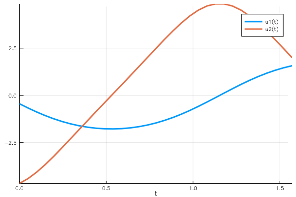
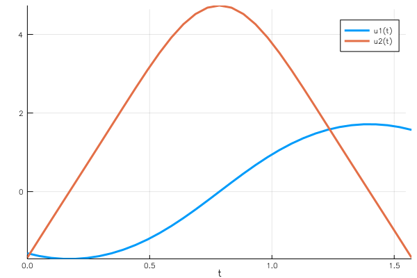

# Boundary Value Problems

This tutorial will introduce you to the functionality for solving BVPs. Other
introductions can be found by [checking out DiffEqTutorials.jl](https://github.com/JuliaDiffEq/DiffEqTutorials.jl). This tutorial assumes you have read the [Ordinary Differential Equations tutorial](ode_example.html).

In this example we will solve the ODE that satisfies the boundary condition in the form of

```math
\begin{align}
\frac{d}{dt} &= f(t, u) \\
g(u) &= \vec{0}
\end{align}
```

## Example 1: Simple Pendulum

The concrete example that we are solving is the simple pendulum ``\ddot{u}+\frac{g}{L}u=0`` on the time interval ``t\in[0,\frac{\pi}{2}]``. First, we need to define the ODE

```julia
using BoundaryValueDiffEq
const g = 9.81
L = 1.0
tspan = (0.0,pi/2)
function simplependulum(t,u,du)
    θ  = u[1]
    dθ = u[2]
    du[1] = dθ
    du[2] = -(g/L)*sin(θ)
end
```

### Boundary Condition

And here is where the `Boundary` comes in. We need to write a function that calculate the residual in-place from the problem solution, such that the residual is $\vec{0}$ when the boundary condition is satisfied.

```julia
function bc1(residual, u)
    residual[1] = u[end÷2][1] + pi/2 # the solution at the middle of the time span should be -pi/2
    residual[2] = u[end][1] - pi/2 # the solution at the end of the time span should be pi/2
end
bvp1 = BVProblem(simplependulum, bc1, [pi/2,pi/2], tspan)
sol1 = solve(bvp1, GeneralMIRK4(), dt=0.05)
plot(sol1)
```



We need to use `GeneralMIRK4` or `Shooting` methods to solve `BVProblem`. We have boundary conditions at the beginning and the ending of the time span in common cases. We can use the `TwoPointBVProblem` problem type for such cases.

```julia
function bc2(residual, ua, ub) # ua is the beginning of the time span, and ub is the ending
    residual[1] = ua[1] + pi/2 # the solution at the beginning of the time span should be -pi/2
    residual[2] = ub[1] - pi/2 # the solution at the end of the time span should be pi/2
end
bvp2 = TwoPointBVProblem(simplependulum, bc2, [pi/2,pi/2], tspan)
sol2 = solve(bvp2, MIRK4(), dt=0.05) # we need to use the MIRK4 solver for TwoPointBVProblem
plot(sol2)
```



We have used the mono-implicit Runge–Kutta (MIRK) method to solve the BVP, but we can always use reduce a BVP to an IVP and a root-finding problem, which is the `Shooting` method. If you can have a good initial guess, shooting method works very well.

```julia
using OrdinaryDiffEq
u₀_2 = [-1.6, -1.7] # the initial guess
sol3 = solve(bvp1, Shooting(Vern7()))
```

Note that user has to import OrdinaryDiffEq.jl before using its IVP solvers.

``julia
plot(sol3)
```


