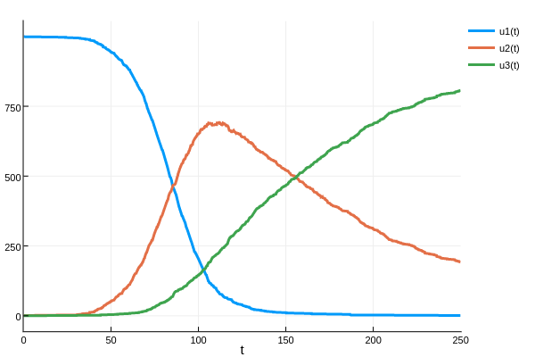
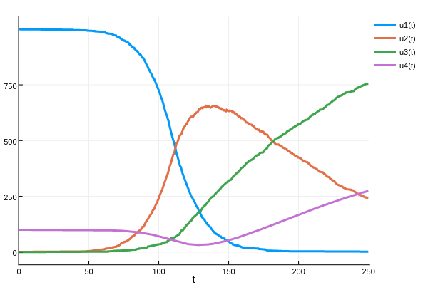
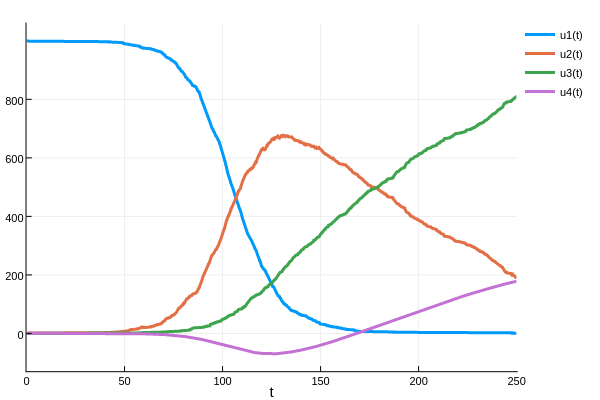
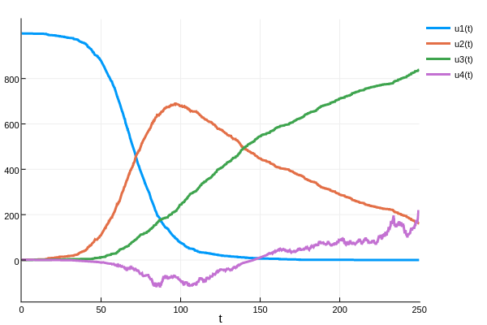

# Discrete Stochastic (Gillespie) Equations

In this tutorial we will describe how to define and solve discrete stochastic
simulations, also known in biological fields as Gillespie-type models. Discrete
stochastic simulations are a form of jump equation with a "trivial" (non-existent)
differential equation. We will first demonstrate how to build these types of models
using the biological modeling functionality, and then describe how to build it
directly and more generally using jumps, and finally show how to add discrete
stochastic simulations to differential equation models.

## Defining a Model using Reactions

For our example, we will build an SIR model which matches the tutorial from 
[Gillespie.jl](https://github.com/sdwfrost/Gillespie.jl). SIR stands for susceptible, infected,
and recovered, and is a model is disease spread. When a susceptible person comes
in contact with an infected person, the disease has a chance of infecting the
susceptible person. This "chance" is determined by the number of susceptible
persons and the number of infected persons, since when there are more people
there is a greater chance that two come in contact. Normally, the rate
is modeled as the amount

```julia
rate_constant*num_of_susceptible_people*num_of_infected_people
```

The `rate_constant` is some constant determined by other factors like the type
of the disease.


Let's build our model using a vector `u`, and let `u[1]` be the number of susceptible
persons, `u[2]` be the number of infected persons, and `u[3]` be the number of
recovered persons. In this case, we can re-write our rate as being:

```julia
rate_constant*u[1]*u[2]
```

Thus we have that our "reactants" are components 1 and 2. When this "reaction"
occurs, the result is that one susceptible person turns into an infected person.
We can think of this as doing:

```julia
u[1] -= 1
u[2] += 1
```

that is, we decrease the number of susceptible persons by 1 and increase the number
of infected persons by 1.

These are the facts that are required to build a `Reaction`. The constructor for
a `Reaction` is as follows:

```julia
Reaction(rate_constant,reactants,stoichiometry)
```

The first value is the rate constant. We will use `1e-4`. Secondly, we pass in the
indices for the reactants. In this case, since it uses the susceptible and infected
persons, the indices are `[1,2]`. Lastly, we detail the stoichometric changes. These
are tuples `(i,j)` where `i` is the reactant and `j` is the number to change by.
Thus `(1,-1)` means "decrease the number of susceptible persons by 1" and
`(2,1)` means "increase the number of infected persons by 1".

Therefore, in total, our reaction is:

```julia
r1 = Reaction(1e-4,[1,2],[(1,-1),(2,1)])
```

To finish the model, we define one more reaction. Over time, infected people become
less infected. The chance that any one person heals during some time unit depends
on the number of people who are infected. Thus the rate at which infected persons
are turning into recovered persons is

```julia
rate_constant*u[2]
```

When this happens, we lose one infected person and gain a recovered person. This
reaction is thus modeled as:

```julia
r2 = Reaction(0.01,[2],[(2,-1),(3,1)])
```

where we have chosen the rate constant `0.01`.

## Building and Solving the Problem

First, we have to define some kind of differential equation. Since we do not want
any continuous changes, we will build a `DiscreteProblem`. We do this by giving
the constructor `u0`, the initial condition, and `tspan`, the timespan. Here, we
will start with `999` susceptible people, `1` infected person, and `0` recovered
people, and solve the problem from `t=0.0` to `t=250.0`. Thus we build the problem
via:

```julia
prob = DiscreteProblem([999,1,0],(0.0,250.0))
```

Now we have to add the reactions/jumps to the problem. We do this using a `GillespieProblem`.
This takes in a differential equation problem `prob` (which we just defined),
a `ConstantJumpAggregator`, and the reactions. The `ConstantJumpAggregator` is
the method by which the constant jumps are aggregated together and solved. In
this case we will use the classic Direct method due to Gillespie, also known as
GillespieSSA. This aggregator is denoted by `Direct()`. Thus we build the
jumps into the problem via:

```julia
jump_prob = GillespieProblem(prob,Direct(),r1,r2)
```

This is now a problem that can be solved using the differential equations solvers.
Since our problem is discrete, we will use the `Discrete()` method.

```julia
sol = solve(jump_prob,Discrete())
```

This solve command takes the standard commands of the common interface, and the
solution object acts just like any other differential equation solution. Thus
there exists a plot recipe, which we can plot with:

```julia
using Plots; plot(sol)
```



## Defining the Jumps Directly

Instead of using the biological modeling functionality of `Reaction`, we can
directly define jumps. This allows for more general types of rates, at the cost
of some modeling friendliness. The constructor for a `ConstantRateJump` is:

```julia
jump = ConstantRateJump(rate,affect!)
```

where `rate` is a function `rate(t,u)` and `affect!` is a function of the integrator
`affect!(integrator)` (for details on the integrator, see the
[integrator interface docs](http://docs.juliadiffeq.org/latest/basics/integrator.html)).
Thus, to define the jump equivalents to the above reactions, we can use:

```julia
rate = (t,u) -> (0.1/1000.0)*u[1]*u[2]
affect! = function (integrator)
  integrator.u[1] -= 1
  integrator.u[2] += 1
end
jump = ConstantRateJump(rate,affect!)

rate = (t,u) -> 0.01u[2]
affect! = function (integrator)
  integrator.u[2] -= 1
  integrator.u[3] += 1
end
jump2 = ConstantRateJump(rate,affect!)
```

We can then use `JumpProblem` to augment a problem with jumps. To add the jumps
to the `DiscreteProblem` and solve it, we would simply do:

```julia
jump_prob = JumpProblem(prob,Direct(),jump,jump2)
sol = solve(jump_prob,Discrete(apply_map=false))
```

## Adding Jumps to a Differential Equation

Notice that if we instead used some form of differential equation instead of a
`DiscreteProblem`, we would add the jumps/reactions to the differential equation.
Let's define an ODE problem, where the continuous part only acts on some new
4th component:

```julia
f = function (t,u,du)
  du[4] = u[2]*u[3]/100000 - u[1]*u[2]/100000
end

prob = ODEProblem(f,[999.0,1.0,0.0,100.0],(0.0,250.0))
```

Notice we gave the 4th component a starting value of 100. The same steps as above
will thus solve this hybrid equation. For example, we can solve it using the
`Tsit5()` method via:

```julia
jump_prob = GillespieProblem(prob,Direct(),r1,r2)
sol = solve(jump_prob,Tsit5())
```



### Caution about Constant Rate Jumps

Note that the assumption which is required for constant rate jumps is that their
reaction rates must be constant on the interval between any constant rate jumps.
Thus in the examples above,

```julia
rate = (t,u) -> (0.1/1000.0)*u[1]*u[2]
rate = (t,u) -> 0.01u[2]
```

both must be constant other than changes due to some constant rate jump (the same
applies to reactions). Since these rates only change when `u[1]` or `u[2]` is changed,
and `u[1]` and `u[2]` only change when one of the jumps occur, this setup is valid.
However, `t*(0.1/1000.0)*u[1]*u[2]` would not be valid because the rate would change
during the interval, as would `(0.1/1000.0)*u[1]*u[4]`. Thus one must be careful
about to follow this rule when choosing rates.

(but note that it's okay for `u[4]` to depend on the other variables because its
updated in a continuous manner!)

If your problem must have the rates depend on a continuously changing quantity,
you need to use the `VariableRateJump` or `VariableRateReaction` instead.

## Adding a VariableRateReaction

Now let's consider adding a reaction whose rate changes continuously with the
differential equation. To continue our example, let's let there be a new reaction
which has the same effect as `r2`, but now is dependent on the amount of `u[4]`.

```julia
r3 = VariableRateReaction(1e-2,[4],[(2,-1),(3,1)])
```

We would expect this reaction to increase the amount of transitions from state
2 to 3. Solving the equation is exactly the same:

```julia
prob = ODEProblem(f,[999.0,1.0,0.0,1.0],(0.0,250.0))
jump_prob = GillespieProblem(prob,Direct(),r1,r2,r3)
sol = solve(jump_prob,Tsit5())
```



Notice that this increases the amount of 3 at the end, reducing the falloff in
the rate (though this model is kind of nonsensical).

Note that even if the problem is a `DiscreteProblem`, `VariableRateJump`s and
`VariableRateReaction`s require a continuous solver, like an ODE/SDE/DDE/DAE solver.

Lastly, we are not restricted to ODEs. For example, we can solve the same jump
problem except with multiplicative noise on `u[4]` by using an `SDEProblem` instead:

```julia
g = function (t,u,du)
  du[4] = 0.1u[4]
end

prob = SDEProblem(f,g,[999.0,1.0,0.0,1.0],(0.0,250.0))
jump_prob = GillespieProblem(prob,Direct(),r1,r2,r3)
sol = solve(jump_prob,SRIW1())
```


