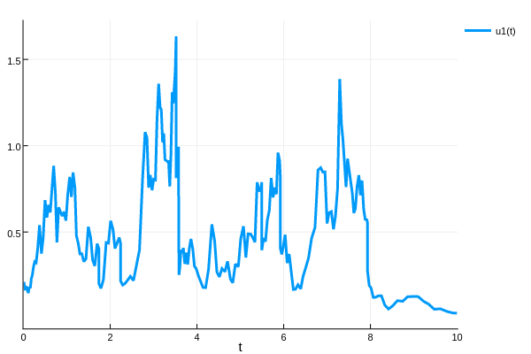

# Jump Diffusion Equations

Jump Diffusion equations are stochastic diffeential equations with discontinuous
jumps. These can be written as:

```math
\frac{du}{dt} = f(t,u) + Σgᵢ(u,t)dWⁱ + Σ h_i(t,u)N_i(t)
```

where ``N_i`` is a Poisson-counter which denotes jumps of size ``h_i``. In this
tutorial we will show how to solve problems with even more general jumps.

## Defining a ConstantRateJump Problem

To start, let's solve an ODE with constant rate jumps. A jump is defined as being
"constant rate" if the rate is only dependent on values from other constant rate
jumps, meaning that its rate must not be coupled with time or the solution to
the differential equation. However, these types of jumps are cheaper to compute.

(Note: if your rate is only "slightly" dependent on the solution of the differential
equation, then it may be okay to use a `ConstantRateJump`. Accuracy loss will be
related to the percentage that the rate changes over the jump intervals.)

Let's solve the following problem. We will have a linear ODE with a Poisson counter
of rate 2 (which is the mean and variance), where at each jump the current solution
will be halved. To solve this problem, we first define the `ODEProblem`:

```julia
f = function (t,u,du)
  du[1] = u[1]
end

prob = ODEProblem(f,[0.2],(0.0,10.0))
```

Notice that, even though our equation is on 1 number, we define it using the
in-place array form. Variable rate jump equations will require this form. Note
that for this tutorial we solve a one-dimensional problem, but the same syntax
applies for solving a system of differential equations with multiple jumps.

Now we define our `rate` equation for our jump. Since it's just the constant
value 2, we do:

```julia
rate = (t,u) -> 2
```

Now we define the `affect!` of the jump. This is the same as an `affect!` from
a `DiscreteCallback`, and thus acts directly on the integrator. Therefore, to
make it halve the current value of `u`, we do:

```julia
affect! = (integrator) -> (integrator.u[1] = integrator.u[1]/2)
```

Then we build our jump:

```julia
jump = ConstantRateJump(rate,affect!)
```

Next, we extend our `ODEProblem` to a `JumpProblem` by attaching the jump:

```julia
jump_prob = JumpProblem(prob,Direct(),jump)
```

We can now solve this extended problem using any ODE solver:

```julia
sol = solve(jump_prob,Tsit5())
plot(sol)
```


## Variable Rate Jumps

Now let's define a jump which is coupled to the differential equation. Let's let
the rate be the current value of the solution, that is:

```julia
rate = (t,u) -> u[1]
```

Using the same `affect!`

```julia
affect! = (integrator) -> (integrator.u[1] = integrator.u[1]/2)
```

we build a `VariableRateJump`:

```julia
jump = VariableRateJump(rate,affect!)
```

To make things interesting, let's copy this jump:

```julia
jump2 = deepcopy(jump)
```

so that way we have two independent jump processes. We now couple these jumps
to the `ODEProblem`:

```julia
jump_prob = JumpProblem(prob,Direct(),jump,jump2)
```

which we once again solve using an ODE solver:

```julia
sol = solve(jump_prob,Tsit5())
plot(sol)
```


## Jump Diffusion

Now we will finally solve the jump diffusion problem. The steps are the same
as before, except we now start with a `SDEProblem` instead of an `ODEProblem`.
Using the same drift function `f` as before, we add multiplicative noise via:

```julia
g = function (t,u,du)
  du[1] = u[1]
end

prob = SDEProblem(f,g,[0.2],(0.0,10.0))
```

and couple it to the jumps:

```julia
jump_prob = JumpProblem(prob,Direct(),jump,jump2)
```

We then solve it using an SDE algorithm:

```julia
sol = solve(jump_prob,SRIW1())
plot(sol)
```


