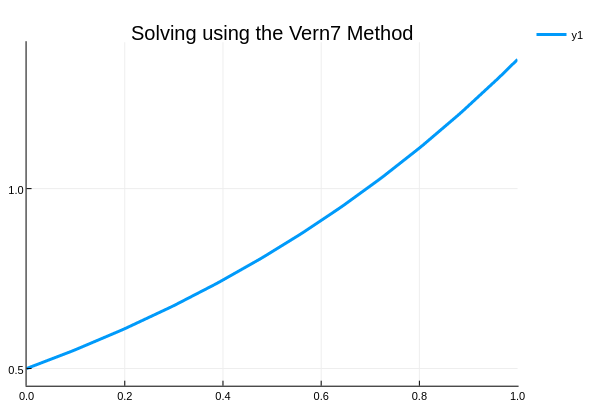
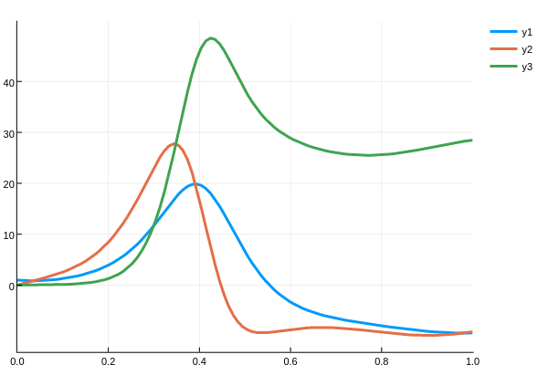

# Ordinary Differential Equations

This tutorial will introduce you to the functionality for solving ODEs. Other
introductions can be found by [checking out DiffEqTutorials.jl](https://github.com/JuliaDiffEq/DiffEqTutorials.jl).

In this example we will solve the equation

```math
\frac{du}{dt} = f(t,u)
```

on the time interval ``t\in[0,1]`` where ``f(t,u)=αu``. We know via Calculus
that the solution to this equation is ``u(t)=u₀\exp(αt)``. To solve this numerically,
we define a problem type by giving it the equation, the initial condition, and
the timespan to solve over:

```julia
using DifferentialEquations
α=1
u0=1/2
f(t,u) = α*u
tspan = (0.0,1.0)
prob = ODEProblem(f,u0,tspan)
```

Note that DifferentialEquations.jl will choose the types for the problem based on
the types used to define the problem type. For our example, notice that `u0` is
a Float64, and therefore this will solve with the independent variables being
Float64. Since `tspan = (0.0,1.0)` is a tuple of Float64's, the dependent variabes
will be solved using Float64's (note that the start time and end time must match
types). You can use this to choose to solve with arbitrary precision numbers,
unitful numbers, etc. Please see the [tutorials](https://github.com/JuliaDiffEq/DiffEqTutorials.jl)
for more details.

After defining a problem, you solve it using `solve`.

```julia
sol = solve(prob)
```

DifferentialEquations.jl has a method for choosing the default solver algorithm
and the (adaptive) stepsizes `dt`, and so this will find an efficient method to solve your
problem. You can also explicitly choose an algorithm and pass in some parameters.

```julia
sol = solve(prob,Euler(),dt=1/2^4)
```

In this case I chose to use the classic Euler method, and gave it a stepsize `dt=1/2^4`.
Normally `dt` is the starting stepsize but since the Euler method is not adaptive
this is the stepsize for the calculation. The available options are described on the
[Common Solver Options manual page](../basics/common_solvers_opts.html).

The result of `solve` is a solution object. We can access the 5th value of the solution with

```julia
sol[5] #.637
```

or get the time of the 8th timestep by

```julia
sol.t[8]
#.438
```

Convenience features are also included. We can build an array using a comprehension
over the solution tuples via

```julia
[t+u for (t,u) in tuples(sol)]
```

or more generally

```julia
[t+2u for (t,u) in zip(sol.t,sol.u)]
```

allows one to use more parts of the solution type. The object that is returned by
default acts as a continuous solution via an interpolation.
We can access the interpolated values by treating `sol` as a function, for example:

```julia
sol(0.45) # The value of the solution at t=0.45
```

For details on more finely controlling the output, see [the Output Specification manual page](../man/output_specification.html)

Plotting commands are provided via a recipe to Plots.jl. To plot the solution
object, simply call plot:

```julia
using Plots
#gr() # You can optionally choose a plotting backend
plot(sol)
```

If you are in Juno, this will plot to the plot pane. To open an interactive GUI
(dependent on the backend), use the `gui` command:

```julia
gui()
```

The plot function can be formatted using [the attributes available in Plots.jl](https://juliaplots.github.io/).
For more of an introduction to plotting solutions,
[see the IJulia notebook](http://nbviewer.jupyter.org/github/JuliaDiffEq/DiffEqTutorials.jl/blob/master/Plotting/Formatting%20the%20Plots.ipynb).

### Other Algorithms

DifferentialEquations.jl offers a much wider variety of solver algorithms than
traditional differential equations libraries. Many of these algorithms are from
recent research and have been shown to be more efficient than the "standard" algorithms
(which are also available). For example, we can choose a 7th order Verner Efficient method:

```julia
sol = solve(prob,Vern7())
plot(sol,title="Solving using the Vern7 Method")
```



Because these advanced algorithms may not be known to most users, DifferentialEquations.jl
offers an advanced method for choosing algorithm defaults. This algorithm utilizes
the precisions of the number types and the keyword arguments (such as the tolerances)
to select an algorithm. Additionally one can provide `alg_hints` to help choose
good defaults using properties of the problem and necessary features for the solution.
For example, if we have a stiff problem but don't know the best stiff algorithm
for this problem, we can use

```julia
sol = solve(prob,alg_hints=[:stiff])
```

[Please see the solver documentation for details on the algorithms and recommendations](../solvers/ode_solve.html).

### Systems of Equations

We can also solve systems of equations. DifferentialEquations.jl can handle many
different independent variable types (generally, anything with a linear index
should work!). So instead of solving a vector equation, let's let u be
a matrix! To do this, we simply need to have u₀ be a matrix, and define f such
that it takes in a matrix and outputs a matrix. We can define a matrix of linear
ODEs as follows:

```julia
A = [1. 0 0 -5
     4 -2 4 -3
     -4 0 0 1
     5 -2 2 3]
u0 = rand(4,2)
tspan = (0.0,1.0)
f(t,u) = A*u
prob = ODEProblem(f,u0,tspan)
```

Here our ODE is on a 4x2 matrix, and the ODE is the linear system defined by
multiplication by `A`. To solve the ODE, we do the same steps
as before.

```julia
sol = solve(prob)
plot(sol)
```


Note that the analysis tools generalize over to systems of equations as well.

```julia
sol[4]
```

still returns the solution at the fourth timestep. It also indexes into the array
as well.

```julia
sol[3,5]
```

is the value of the 5th component (by linear indexing) at the 3rd timepoint, or

```julia
sol[:,2,1]
```

is the timeseries for the component which is the 2nd row and 1 column.

### In-Place Updates

Defining your ODE function to be in-place updating can have performance benefits.
What this means is that, instead of writing a function which outputs its solution,
write a function which updates a vector that is designated to hold the solution.
By doing this, DifferentialEquations.jl's solver packages are able to reduce the
amount of array allocations and achieve better performance.

For our example we will use [the Lorenz system](https://en.wikipedia.org/wiki/Lorenz_system).
What we do is simply write the output to the 3rd input of the function. For example:

```julia
function lorenz(t,u,du)
 du[1] = 10.0(u[2]-u[1])
 du[2] = u[1]*(28.0-u[3]) - u[2]
 du[3] = u[1]*u[2] - (8/3)*u[3]
end
```

and then we can use this function in a problem:

```julia
u0 = [1.0;0.0;0.0]
tspan = (0.0,1.0)
prob = ODEProblem(lorenz,u0,tspan)
sol = solve(prob)
```



### Defining Systems of Equations Using ParameterizedFunctions.jl

To simplify your life, ParameterizedFunctions.jl provides the `@ode_def` macro
for "defining your ODE in pseudocode" and getting a function which is efficient
and runnable.

To use the macro, you write out your system of equations with the left-hand side
being `d_` and those variables will be parsed as the independent variables. The
dependent variable is `t`, and the other variables are parameters which you pass
at the end. For example, we can write the Lorenz system as:

```julia
using ParameterizedFunctions
g = @ode_def LorenzExample begin
  dx = σ*(y-x)
  dy = x*(ρ-z) - y
  dz = x*y - β*z
end σ=>10.0 ρ=>28.0 β=(8/3)
```

DifferentialEquations.jl will automatically translate this to be exactly the
same as `f`. The result is more legible code with no performance loss.
The result is that `g` is a function which you can now use to define the Lorenz
problem.

```julia
u0 = [1.0;0.0;0.0]
tspan = (0.0,1.0)
prob = ODEProblem(g,u0,tspan)
```

Since we used `=>`, `σ` and `ρ` are kept as mutable parameters.
For example we can do:

```julia
g.σ = 11.0
```

to change the value of `σ` to 11.0. `β` is not able to be changed since we defined
it using `=`. We can create a new instance with new parameters via the name used in
the `@ode_def` command:

```julia
h = LorenzExample(σ=11.0,ρ=25.0)
```

Note that the values will default to the values given to the `@ode_def` command.

One last item to note is that you probably received a warning when defining this:

```julia
WARNING: Hessian could not invert
```

This is because the Hessian of the system was not able to be inverted. ParameterizedFunctions.jl
does "behind-the-scenes" symbolic calculations to pre-compute things like the Jacobian,
inverse Jacobian, etc. in order to speed up calculations. Thus not only will this
lead to legible ODE definitions, but "unfairly fast" code! We can turn off some of
the calculations by using a more specific macro. Here, we can turn off the Hessian
calculations via `@ode_def_nohes`. See [ParameterizedFunctions.jl](https://github.com/JuliaDiffEq/ParameterizedFunctions.jl)
for more details.

Since the parameters exist within the function, functions defined in this manner
can also be used for sensitivity analysis, parameter estimation routines,
and bifurcation plotting. This makes DifferentialEquations.jl a full-stop solution
for differential equation analysis which also achieves high performance.
