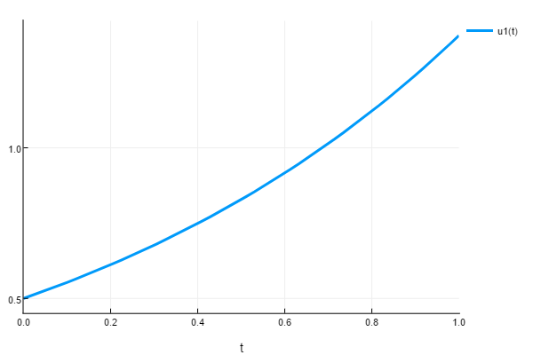
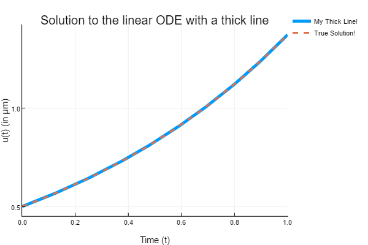
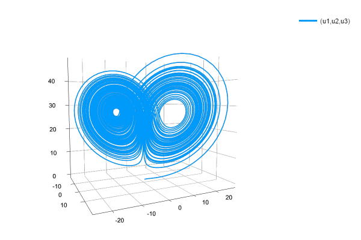
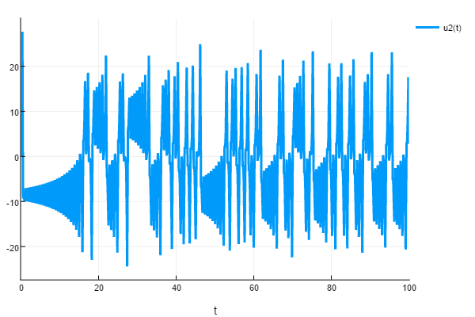

# Ordinary Differential Equations

This tutorial will introduce you to the functionality for solving ODEs. Other
introductions can be found by [checking out DiffEqTutorials.jl](https://github.com/JuliaDiffEq/DiffEqTutorials.jl).

## Example 1 : Solving Scalar Equations

In this example we will solve the equation

```math
\frac{du}{dt} = f(t,u)
```

on the time interval ``t\in[0,1]`` where ``f(t,u)=αu``. We know via Calculus
that the solution to this equation is ``u(t)=u₀\exp(αt)``.

### Step 1: Defining a Problem

To solve this numerically, we define a problem type by giving it the equation,
the initial condition, and the timespan to solve over:

```julia
using DifferentialEquations
u0=1/2
f(t,u) = 1.01*u
tspan = (0.0,1.0)
prob = ODEProblem(f,u0,tspan)
```

Note that DifferentialEquations.jl will choose the types for the problem based on
the types used to define the problem type. For our example, notice that `u0` is
a Float64, and therefore this will solve with the dependent variables being
Float64. Since `tspan = (0.0,1.0)` is a tuple of Float64's, the independent variabes
will be solved using Float64's (note that the start time and end time must match
types). You can use this to choose to solve with arbitrary precision numbers,
unitful numbers, etc. Please see the [notebook tutorials](https://github.com/JuliaDiffEq/DiffEqTutorials.jl)
for more examples.

The problem types include many other features, including the ability to define
mass matrices and hold callbacks for events. Each problem type has a page which
details its constructor and the available fields. For
[ODEs, the appropriate page is here](http://docs.juliadiffeq.org/latest/types/ode_types.html).
In addition, a user can specify additional functions to be associated with the
function in order to speed up the solvers. These are detailed
[at the performance overloads page](http://docs.juliadiffeq.org/latest/features/performance_overloads.html).

### Step 2: Solving a Problem

#### Controlling the Solvers

After defining a problem, you solve it using `solve`.

```julia
sol = solve(prob)
```

The solvers can be controlled using the available options are described on the
[Common Solver Options manual page](../basics/common_solver_opts.html). For example,
we can lower the relative tolerance (in order to get a more correct result, at
the cost of more timesteps) by using the command `reltol`:

```julia
sol = solve(prob,reltol=1e-6)
```

There are many controls for handling outputs. For example, we can choose to have
the solver save every `0.1` time points by setting `saveat=0.1`. Chaining this
with the tolerance choice looks like:

```julia
sol = solve(prob,reltol=1e-6,saveat=0.1)
```

More generally, `saveat` can be any collection of time points to save at.
Note that this uses interpolations to keep the timestep unconstrained to speed
up the solution. In addition, if we only care about the endpoint, we can turn
off intermediate saving in general:

```julia
sol = solve(prob,reltol=1e-6,save_everystep=false)
```

which will only save the final time point.

#### Choosing a Solver Algorithm

DifferentialEquations.jl has a method for choosing the default solver algorithm
and the (adaptive) stepsizes `dt`, and so this will find an efficient method to solve your
problem. Because these advanced algorithms may not be known to most users, DifferentialEquations.jl
offers a method for choosing algorithms through hints. This default chooser utilizes
the precisions of the number types and the keyword arguments (such as the tolerances)
to select an algorithm. Additionally one can provide `alg_hints` to help choose
good defaults using properties of the problem and necessary features for the solution.
For example, if we have a stiff problem where we need high accuracy,
but don't know the best stiff algorithm for this problem, we can use:

```julia
sol = solve(prob,alg_hints=[:stiff],reltol=1e-8,abstol=1e-8)
```

You can also explicitly choose the algorithm to use. DifferentialEquations.jl
offers a much wider variety of solver algorithms than traditional differential
equations libraries. Many of these algorithms are from recent research and have
been shown to be more efficient than the "standard" algorithms (which are also
available). For example, we can choose a 7th order Verner Efficient method:

```julia
sol = solve(prob,Vern7())
```

For users familiar with MATLAB/Python/R, good translations of the standard library
methods are as follows:

- `ode23` --> `BS3()`
- `ode45`/`dopri5` --> `DP5()`, though in most cases `Tsit5()` is more efficient
- `ode23s` --> `Rosenbrock23()`
- `ode113` --> `CVODE_Adams()`, though in many cases `Vern7()` is more efficient
- `dop853` --> `DP8()`, though in most cases `Vern7()` is more efficient
- `ode15s`/`vode` --> `CVODE_BDF()`, though in many cases `radau()` is more efficient
- `ode23t` --> `Trapezoid()`
- `lsoda` --> `lsoda()` (requires `Pkg.add("LSODA"); using LSODA`)
- `ode15i` --> `IDA()`

In DifferentialEquations.jl, some good "go-to" choices for ODEs are:

- `Tsit5()` for non-stiff
- `Vern7()` for
- `Rosenbrock23()` for stiff equations with Julia-defined types, events, etc.
- `CVODE_BDF()` or `radau()` for stiff equations of `Vector{Float64}`

Note that `radau()` requires the installation of `ODEInterfaceDiffEq`:

```julia
Pkg.add("ODEInterfaceDiffEq")
using ODEInterfaceDiffEq
```

This solve interface, known as the common interface, is actually pooling together
the methods from many different packages into a single API. For a comprehensive
list of the available algorithms and detailed recommendations,
[Please see the solver documentation](../solvers/ode_solve.html). Every problem
type has an associated page detailing all of the solvers associated with the problem.
In many cases, you may not need the full functionality of all of the packages
together and may want to reduce the size of your dependency. To find out
require use only the parts of DifferentialEquations.jl you're specifically using,
see the [low dependency usage manual page](../featuers/low_dep.html).

Note that the solver controls can be combined with the algorithm choice. Thus
we can for example solve the problem using `Vern7()` with a lower tolerance
via:

```julia
sol = solve(prob,Vern7(),reltol=1e-8,abstol=1e-8)
```

### Step 3: Analyzing the Solution

#### Handling the Solution Type

The result of `solve` is a solution object. We can access the 5th value of the
solution with:

```julia
sol[5] #.637
```

or get the time of the 8th timestep by:

```julia
sol.t[8]
#.438
```

Convenience features are also included. We can build an array using a
comprehension over the solution tuples via:

```julia
[t+u for (t,u) in tuples(sol)]
```

or more generally

```julia
[t+2u for (t,u) in zip(sol.t,sol.u)]
```

allows one to use more parts of the solution type. The object that is returned by
default acts as a continuous solution via an interpolation. We can access the
interpolated values by treating `sol` as a function, for example:

```julia
sol(0.45) # The value of the solution at t=0.45
```

If in the solver `dense=true` (this is the default unless `saveat` is used), then
this interpolation is a high order interpolation and thus usually matches the
error of the solution time points. The interpolations associated with each solver
is [detailed at the solver algorithm page](../solvers/ode_solve.html). If `dense=false`
(unless specifically set, this only occurs when `save_everystep=false` or `saveat`
is used) then this defaults to giving a linear interpolation.

For details on more handling the output, see [the solution handling page](../basics/solution.html).

#### Plotting Solutions

While one can directly plot solution time points using the tools given above,
convenience commands are defined by recipes for Plots.jl. To plot the solution
object, simply call plot:

```julia
#Pkg.add("Plots") # You need to install Plots.jl before your first time using it!
using Plots
#gr() # You can optionally choose a plotting backend
plot(sol)
```



If you are in Juno, this will plot to the plot pane. To open an interactive GUI
(dependent on the backend), use the `gui` command:

```julia
gui()
```

The plot function can be formatted using [the attributes available in Plots.jl](https://juliaplots.github.io/).
Additional DiffEq-specific controls are documented [at the plotting page](../basics/plot.html).

For example, from the Plots.jl attribute page we see that the line width can be
set via the argument `linewidth`. Additionally, a title can be set with `title`.
Thus we add these to our plot command to get the correct output:

```julia
plot(sol,linewidth=5,title="Solution to the linear ODE with a thick line")
```



## Example 2: Solving Systems of Equations

In this example we will solve the Lorenz equations:

```math
  \frac{dx}{dt} = σ*(y-x)
  \frac{dy}{dt} = x*(ρ-z) - y
  \frac{dz}{dt} = x*y - β*z
```

Defining your ODE function to be in-place updating can have performance benefits.
What this means is that, instead of writing a function which outputs its solution,
you write a function which updates a vector that is designated to hold the solution.
By doing this, DifferentialEquations.jl's solver packages are able to reduce the
amount of array allocations and achieve better performance.

The way we do this is we simply write the output to the 3rd input of the function.
For example, our Lorenz equation problem would be defined by the function:

```julia
function lorenz(t,u,du)
 du[1] = 10.0(u[2]-u[1])
 du[2] = u[1]*(28.0-u[3]) - u[2]
 du[3] = u[1]*u[2] - (8/3)*u[3]
end
```

and then we can use this function in a problem:

```julia
u0 = [1.0;0.0;0.0]
tspan = (0.0,100.0)
prob = ODEProblem(lorenz,u0,tspan)
sol = solve(prob)
```

Using the plot recipe tools [defined on the plotting page](http://docs.juliadiffeq.org/latest/basics/plot.html#Choosing-Variables-1),
we can choose to do a 3D phase space plot between the different variables:

```julia
plot(sol,vars=(1,2,3))
```



Note that the default plot for multi-dimensional systems is an overlay of
each timeseries. We can plot the timeseries of just the second component using
the variable choices interface once more:

```julia
plot(sol,vars=(0,2))
```



Note that here "variable 0" corresponds to the dependent variable ("time").

#### Defining Systems of Equations Using ParameterizedFunctions.jl

To simplify your life, the `@ode_def` macro allows for "defining your ODE in
pseudocode" and getting a function which is efficient and runnable.

To use the macro, you write out your system of equations with the left-hand side
being `d_` and those variables will be parsed as the dependent variables. The
independent variable is `t`, and the other variables are parameters which you pass
at the end. For example, we can write the Lorenz system as:

```julia
g = @ode_def LorenzExample begin
  dx = σ*(y-x)
  dy = x*(ρ-z) - y
  dz = x*y - β*z
end σ=>10.0 ρ=>28.0 β=(8/3)
```

DifferentialEquations.jl will automatically translate this to be exactly the
same as `f`. The result is more legible code with no performance loss.
The result is that `g` is a function which you can now use to define the Lorenz
problem.

```julia
u0 = [1.0;0.0;0.0]
tspan = (0.0,1.0)
prob = ODEProblem(g,u0,tspan)
```

Since we used `=>`, `σ` and `ρ` are kept as mutable parameters.
For example we can do:

```julia
g.σ = 11.0
```

to change the value of `σ` to 11.0. `β` is not able to be changed since we defined
it using `=`. We can create a new instance with new parameters via the name used in
the `@ode_def` command:

```julia
h = LorenzExample(σ=11.0,ρ=25.0)
```

Note that the values will default to the values given to the `@ode_def` command.

One last item to note is that you probably received a warning when defining this:

```julia
WARNING: Hessian could not invert
```

This is because the Hessian of the system was not able to be inverted. ParameterizedFunctions.jl
does "behind-the-scenes" symbolic calculations to pre-compute things like the Jacobian,
inverse Jacobian, etc. in order to speed up calculations. Thus not only will this
lead to legible ODE definitions, but "unfairly fast" code! We can turn off some of
the calculations by using a more specific macro. Here, we can turn off the Hessian
calculations via `@ode_def_nohes`. See [ParameterizedFunctions.jl](https://github.com/JuliaDiffEq/ParameterizedFunctions.jl)
for more details.

Since the parameters exist within the function, functions defined in this manner
can also be used for sensitivity analysis, parameter estimation routines,
and bifurcation plotting. This makes DifferentialEquations.jl a full-stop solution
for differential equation analysis which also achieves high performance.

## Example 3: Using Other Types for Systems of Equations

DifferentialEquations.jl can handle many different dependent variable types
(generally, anything with a linear index should work!). So instead of solving a
vector equation, let's let u be a matrix! To do this, we simply need to have u₀
be a matrix, and define f such that it takes in a matrix and outputs a matrix.
We can define a matrix of linear ODEs as follows:

```julia
A = [1. 0 0 -5
     4 -2 4 -3
     -4 0 0 1
     5 -2 2 3]
u0 = rand(4,2)
tspan = (0.0,1.0)
f(t,u) = A*u
prob = ODEProblem(f,u0,tspan)
```

Here our ODE is on a 4x2 matrix, and the ODE is the linear system defined by
multiplication by `A`. To solve the ODE, we do the same steps
as before.

```julia
sol = solve(prob)
plot(sol)
```


We can instead use the in-place form by using Julia's in-place matrix multiplication
function `A_mul_B!`:

```julia
f(t,u,du) = A_mul_B!(du,A,u)
```

Additionally, we can use non-traditional array types as well. For example,
`StaticArrays.jl` offers immutable arrays which are stack-allocated, meaning
that their usage does not require any (slow) heap-allocations that arrays
normally have. This means that they can be used to solve the same problem as
above, with the only change being the type for the initial condition and constants:

```julia
using StaticArrays, DifferentialEquations
A = @SMatrix [ 1.0  0.0 0.0 -5.0
               4.0 -2.0 4.0 -3.0
              -4.0  0.0 0.0  1.0
               5.0 -2.0 2.0  3.0]
u0 = @SMatrix rand(4,2)
tspan = (0.0,1.0)
f(t,u) = A*u
prob = ODEProblem(f,u0,tspan)
sol = solve(prob)
using Plots; plot(sol)
```

Note that the analysis tools generalize over to systems of equations as well.

```julia
sol[4]
```

still returns the solution at the fourth timestep. It also indexes into the array
as well. The last value is the timestep, and the beginning values are for the component.
This means

```julia
sol[5,3]
```

is the value of the 5th component (by linear indexing) at the 3rd timepoint, or

```julia
sol[2,1,:]
```

is the timeseries for the component which is the 2nd row and 1 column.

## Going Beyond ODEs: How to Use the Documentation

Not everything can be covered in the tutorials. Instead, this tutorial will end
by pointing you in the directions for the next steps.

#### Common API for Defining, Solving, and Plotting

One feature of DifferentialEquations.jl is that this pattern for solving equations
is conserved across the different types of differential equations. Every equation
has a problem type, a solution type, and the same solution handling (+ plotting)
setup. Thus the solver and plotting commands in the **Basics** section applies to
all sorts of equations, like stochastic differential equations and delay differential
equations. Each of these different problem types are defined in the **Problem Types**
section of the docs. Every associated solver algorithm is detailed in the
**Solver Algorithms** section, sorted by problem type. The same steps for ODEs
can then be used for the analysis of the solution.

#### Additional Features and Analysis Tools

In many cases, the common workflow only starts with solving the differential equation.
Many common setups have built-in solutions in DifferentialEquations.jl. For example,
check out the features for:

- [Handling, parallelizing, and analyzing large Monte Carlo experiments](../features/monte_carlo.html)
- [Saving the output to tabular formats like DataFrames and CSVs](../features/io.html)
- [Event handling](../features/callback_functions.html)
- [Parameter estimation (inverse problems)](../analysis/parameter_estimation.html)
- [Quantification of numerical uncertainty and error](../analysis/uncertainty_quantification.html)

Many more are defined in the relevant sections of the docs. Please explore the rest
of the documentation, including tutorials for getting started with other types
of equations. In addition, to get help, please either
[file an issue at the main repository](https://github.com/JuliaDiffEq/DifferentialEquations.jl)
or [come have an informal discussion at our Gitter chatroom](https://gitter.im/JuliaDiffEq/Lobby).
