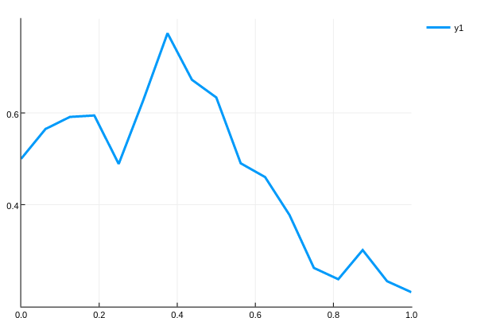
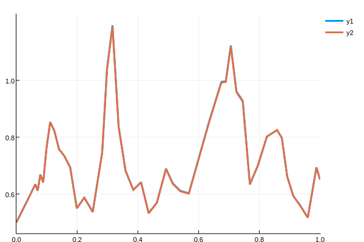

# Stochastic Differential Equations (SDE)

This tutorial will introduce you to the functionality for solving SDE. Other
introductions can be found by [checking out DiffEqTutorials.jl](https://github.com/JuliaDiffEq/DiffEqTutorials.jl).

## Basics

In this example we will solve the equation

```math
du = f(t,u)dt + Σgᵢ(t,u)dWⁱ
```

where ``f(t,u)=αu`` and ``g(t,u)=βu``. We know via Stochastic Calculus that the
solution to this equation is ``u(t,W)=u₀\exp((α-\frac{β^2}{2})t+βW)``. To solve this
numerically, we define a problem type by giving it the equation and the initial
condition:

```julia
using DifferentialEquations
α=1
β=1
u₀=1/2
f(t,u) = α*u
g(t,u) = β*u
dt = 1//2^(4)
tspan = (0.0,1.0)
prob = SDEProblem(f,g,u₀,(0.0,1.0))
```

The `solve` interface is then the same as with ODEs. Here we will use the classic
Euler-Maruyama algorithm `EM` and plot the solution:

```julia
sol = solve(prob,EM(),dt=dt)
using Plots; plotly() # Using the Plotly backend
plot(sol)
```



## Higher Order Methods

One unique feature of DifferentialEquations.jl is that higher-order methods for
stochastic differential equations are included. For reference, let's also give
the `SDEProblem` the analytical solution. We can do this by making a test problem.
This can be  a good way to judge how accurate the algorithms are, or is used to
test convergence of the algorithms for methods developers. Thus we define the problem
object with:

```julia
analytic(t,u₀,W) = u₀*exp((α-(β^2)/2)*t+β*W)
prob = SDETestProblem(f,g,u₀,analytic)
```

and then we pass this information to the solver and plot:

```julia
#We can plot using the classic Euler-Maruyama algorithm as follows:
sol =solve(prob,EM(),dt=dt)
plot(sol,plot_analytic=true)
```


We can choose a higher-order solver for a more accurate result:

```julia
sol =solve(prob,SRIW1(),dt=dt,adaptive=false)
plot(sol,plot_analytic=true)
```


By default, the higher order methods have adaptivity. Thus one can use

```julia
sol =solve(prob,SRIW1())
plot(sol,plot_analytic=true)
```


Here we allowed the solver to automatically determine a starting `dt`. This estimate
at the beginning is conservative (small) to ensure accuracy. We can instead start
the method with a larger `dt` by passing in a value for the starting `dt`:

```julia
sol =solve(prob,SRIW1(),dt=dt)
plot(sol,plot_analytic=true)
```


