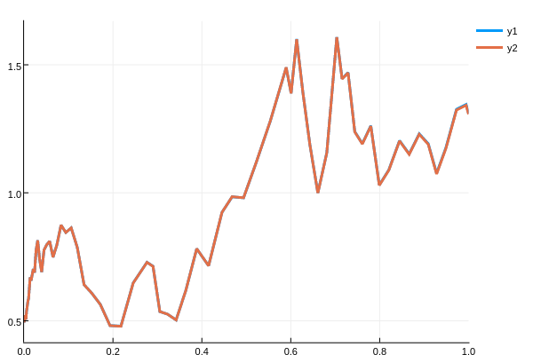

# Stochastic Differential Equations

This tutorial will introduce you to the functionality for solving SDEs. Other
introductions can be found by [checking out DiffEqTutorials.jl](https://github.com/JuliaDiffEq/DiffEqTutorials.jl). This tutorial assumes you have read the [Ordinary Differential Equations tutorial](ode_example.html).

### Basics

In this example we will solve the equation

```math
du = f(t,u)dt + Σgᵢ(t,u)dWⁱ
```

where ``f(t,u)=αu`` and ``g(t,u)=βu``. We know via Stochastic Calculus that the
solution to this equation is ``u(t,W)=u₀\exp((α-\frac{β^2}{2})t+βW)``. To solve this
numerically, we define a problem type by giving it the equation and the initial
condition:

```julia
using DifferentialEquations
α=1
β=1
u₀=1/2
f(t,u) = α*u
g(t,u) = β*u
dt = 1//2^(4)
tspan = (0.0,1.0)
prob = SDEProblem(f,g,u₀,(0.0,1.0))
```

The `solve` interface is then the same as with ODEs. Here we will use the classic
Euler-Maruyama algorithm `EM` and plot the solution:

```julia
sol = solve(prob,EM(),dt=dt)
using Plots; plotly() # Using the Plotly backend
plot(sol)
```


### Higher Order Methods

One unique feature of DifferentialEquations.jl is that higher-order methods for
stochastic differential equations are included. For reference, let's also give
the `SDEProblem` the analytical solution. We can do this by making a test problem.
This can be a good way to judge how accurate the algorithms are, or is used to
test convergence of the algorithms for methods developers. Thus we define the problem
object with:

```julia
analytic(t,u₀,W) = u₀*exp((α-(β^2)/2)*t+β*W)
prob = SDETestProblem(f,g,u₀,analytic)
```

and then we pass this information to the solver and plot:

```julia
#We can plot using the classic Euler-Maruyama algorithm as follows:
sol =solve(prob,EM(),dt=dt)
plot(sol,plot_analytic=true)
```


We can choose a higher-order solver for a more accurate result:

```julia
sol =solve(prob,SRIW1(),dt=dt,adaptive=false)
plot(sol,plot_analytic=true)
```


By default, the higher order methods have adaptivity. Thus one can use

```julia
sol =solve(prob,SRIW1())
plot(sol,plot_analytic=true)
```



Here we allowed the solver to automatically determine a starting `dt`. This estimate
at the beginning is conservative (small) to ensure accuracy. We can instead start
the method with a larger `dt` by passing in a value for the starting `dt`:

```julia
sol =solve(prob,SRIW1(),dt=dt)
plot(sol,plot_analytic=true)
```


## Non-Diagonal Noise

All of the previous examples had diagonal noise, that is a vector of random numbers
`dW` whose size matches the output of `g`, and the noise is applied element-wise.
However, a more general type of noise allows for the terms to linearly mixed.

Let's define a problem with four Wiener processes and two dependent random variables.
In this case, we will want the output of `g` to be a 2x4 matrix, such that the solution
is `g(t,u)*dW`, the matrix multiplication. For example, we can do the following:

```julia
f = (t,u,du) -> du.=1.01u
g = function (t,u,du)
  du[1,1] = 0.3u[1]
  du[1,2] = 0.6u[1]
  du[1,3] = 0.9u[1]
  du[1,4] = 0.12u[2]
  du[2,1] = 1.2u[1]
  du[2,2] = 0.2u[2]
  du[2,3] = 0.3u[2]
  du[2,4] = 1.8u[2]
end
prob = SDEProblem(f,g,ones(2),(0.0,1.0),noise_rate_prototype=zeros(2,4))
```

In our `g` we define the functions for computing the values of the matrix. The matrix
itself is determined by the keyword argument `noise_rate_prototype` in the `SDEProblem`
constructor. This is a prototype for the type that `du` will be in `g`. This can
be any `AbstractMatrix` type. Thus for example, we can define the problem as

```julia

# Define a sparse matrix by making a dense matrix and setting some values as not zero
A = zeros(2,4)
A[1,1] = 1
A[1,4] = 1
A[2,4] = 1
sparse(A)

# Make `g` write the sparse matrix values
g = function (t,u,du)
  du[1,1] = 0.3u[1]
  du[1,4] = 0.12u[2]
  du[2,4] = 1.8u[2]
end

# Make `g` use the sparse matrix
prob = SDEProblem(f,g,ones(2),(0.0,1.0),noise_rate_prototype=A)
```

and now `g(t,u)` writes into a sparse matrix, and `g(t,u)*dW` is sparse matrix
multiplication.
